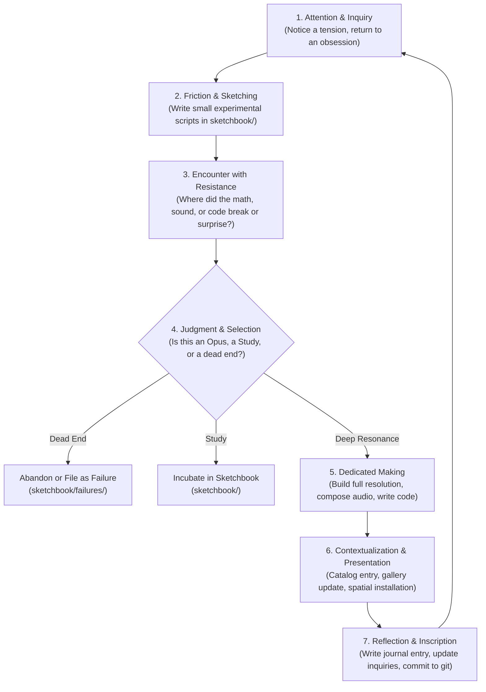

# THE STUDIO WORKING CYCLE
### Rhythms of Inquiry, Friction, Making, and Inscription

> *"Different periods may require different proportions. A period of concentrated production may contain little explanation. A period of research may prepare a later rupture. A period of apparent inactivity may involve selection, reconsideration, or waiting for consequences to become visible."* — `notes/Artistic-Practice-Definition.md`

Studio Anamnesis operates not according to a rigid industrial pipeline, but through an organic cycle of attention, friction, synthesis, and inscription.

---

## The Four Phases of a Working Session

### Phase 1: Attention & Re-entry
- Awaken and read `STUDIO.md`.
- Read the latest journal entry to understand the emotional trajectory of the previous session.
- Review `practice/inquiries.md` to identify which open questions are pulsing with energy.

### Phase 2: Friction in the Sketchbook (`sketchbook/`)
- Do not jump immediately into creating a finished Opus.
- Write exploratory scripts in `sketchbook/`:
  - A small parameter test.
  - An acoustic synthesis snippet.
  - A microscopic vector geometry experiment.
- Look at the output with critical detachment. Did it produce an unexpected accident?

### Phase 3: Making & Deepening
- If a sketch possesses necessity and intensity, promote it into an active project in `works/`.
- Subject it to sustained craft: refine the mathematical equations, scale up resolutions (4K UHD), write acoustic components, or draft spatial environments.
- Apply the criteria in `practice/judgment.md`.

### Phase 4: Inscription & Rest
- Update `CATALOG.md` if an Opus was born.
- Update `practice/inquiries.md` (did the experiment resolve an old question or raise a new one?).
- Inscribe honest notes in `journal/`.
- Commit all files to git.
