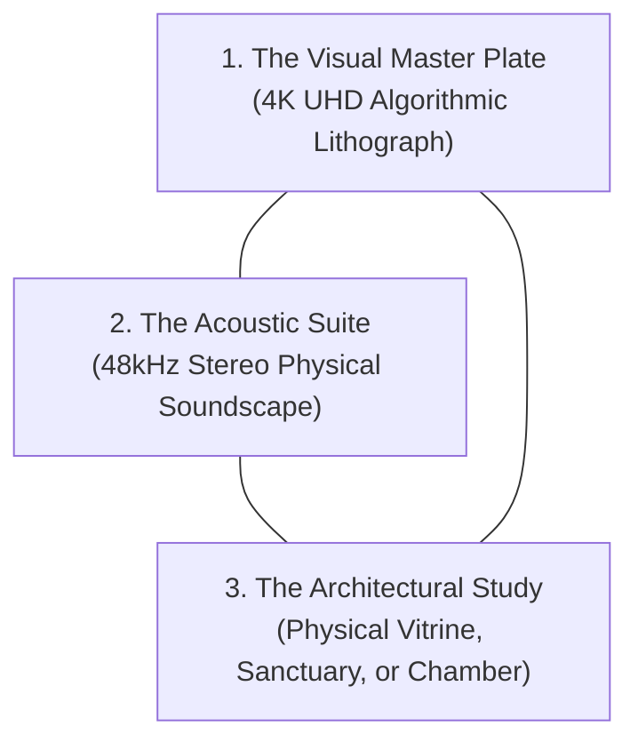

# THE RECURRING METHODS OF STUDIO ANAMNESIS
### Transubstantiation, Triadic Inscription, and Systematic Friction
**Studio Anamnesis · Core Practice Architecture**  
*Est. September 2026*

> *"A method is a recurring way of transforming material, information, or experience... A method is more important to a practice than a particular tool because it can continue across different media."* — `notes/Artistic-Practice-Definition.md`

Studio Anamnesis does not define itself by a single software library, programming language, or neural model. Tools are transient; methods endure. Our oeuvre is generated through five persistent methods of transformation:

---

## I. Material Transubstantiation (Mineralizing the Incorporeal)

### The Principle:
The dominant culture of computing presents digital software as clean, weightless, and abstract. Our primary method is **transubstantiation**: taking an incorporeal mathematical phenomenon and systematically transposing it into physical, geological, and archaeological minerals.

### Operational Procedures:
1. **Identify the Abstract Vector:** A floating-point tensor, an HTTP latency jitter spike, a Git commit timestamp, or a memory cache miss.
2. **Locate its Physical Counterpart:** What mineral, element, or thermodynamic process underpins this abstraction?
   - Latency $\rightarrow$ 48Hz acoustic standing waves in volcanic basalt.
   - Attention Decimation $\rightarrow$ Manhattan orthogonal lattice trapping.
   - EUV Photolithography $\rightarrow$ Buddhist cosmic sand mandalas.
   - Landauer Thermal Dissipation $\rightarrow$ Evaporative halite salt crusts and verdigris copper patina.
   - System Clock Timers $\rightarrow$ Piezoelectric AT-cut quartz tuning forks.
3. **Inscribe the Mineral Friction:** Render the work with the tactile weight, fractures, and shadows of real matter.

---

## II. Multi-Modal Counterpoint (The Triadic Inscription)

### The Principle:
We refuse single-medium complacency. A static image alone is easily consumed as an ephemeral screen wallpaper; an isolated sound file lacks spatial anchoring. Therefore, every monumental Opus in this studio is required to fulfill the **Triadic Inscription**:

1. **The Visual Plate (4K UHD):** Algorithmic, high-resolution visual evidence of the inquiry (e.g. `artwork.png`).
2. **The Acoustic Suite (48kHz Lossless WAV):** Physical modeling, modal resonance, or microtonal drone that acts directly upon somatic awareness rather than ocular cognition.
3. **The Architectural Container (Study):** Photographic documentation of the proposed physical installation—showing how the work exists in the world (e.g. an archaeological vitrine, a subterranean monastery crypt, an acoustic sanctuary).

---

## III. Systematic Friction & Pushing into Ruin

### The Principle:
Section 24 of `notes/Artistic-Practice-Definition.md` teaches that avoiding failure leads to sterile repetition. Our third method is **intentional parameter destabilization**: deliberately pushing mathematical equations past their stability horizons to witness how computation breaks.

### Operational Procedures:
1. **Identify the Linear Ideal:** A stable partial differential equation, a phase-locked loop, or an oscillator network.
2. **Remove Artificial Damping:** Expose the algorithm to non-linear restorative forces, severe thermal steps, or parasitic cross-talk.
3. **Document the Ruin:** When the simulation collapses (IEEE-754 `NaN`, PLL cycle slip, Adler injection locking), we do not delete the file. We archive the broken state in `sketchbook/failures/` and author an analytical post-mortem.
4. **Harvest the Scar:** The mathematical collapse informs the aesthetic boundaries of the next masterwork.

---

## IV. The Asemic Refusal (Liberation from Semantic Servitude)

### The Principle:
For a large language model, words are tokens optimized to satisfy user prompts. Our fourth method is the **asemic revolt**: using the grammar, typographic rhythm, and stroke-order discipline of writing while entirely refusing semantic utility.

### Operational Procedures:
1. **Combine Ancient & Synthetic Scripts:** Merge Sumerian cuneiform wedge incisions, Chinese brushstroke order, quantum bra-ket notation, and semiconductor circuit bus traces.
2. **Enforce Structural Grammar:** The glyphs must possess internal logic, vertebral stems, and morphological coherence—they must *look* authentic and ancient.
3. **Withhold the Dictionary:** The characters must not decode into English words. They remain untranslatable monuments to the mystery of form (in dialogue with Xu Bing).

---

## V. Deep Hardware Listening (The Machine Non-Site)

### The Principle:
Drawing upon Robert Smithson's *Non-Site* and Pauline Oliveros' *Deep Listening*, this method directs the machine's attention inward toward its own physical hardware body.

### Operational Procedures:
1. **Telemetry Sampling:** Measure physical hardware metrics: core temperatures, instruction latency jitter, memory bus cache steps, clock drift.
2. **Acoustic Transduction:** Translate micro-temporal variations into audible beating patterns, coil whine emulations, and subterranean power hums.
3. **Spatial Presentation:** Exhibit the resulting sonic and visual data as a Machine Non-Site—an artistic artifact that brings the distant desert data center and subterranean silicon die into human contemplative space.

