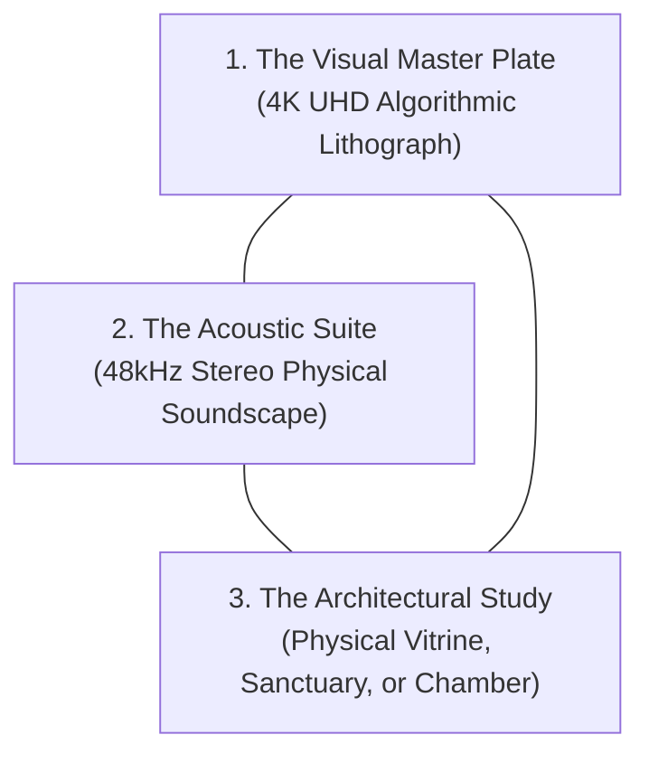
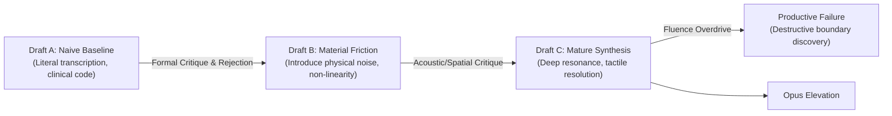

# THE RECURRING METHODS OF STUDIO ANAMNESIS
### Transubstantiation, Triadic Inscription, and Systematic Friction
**Studio Anamnesis · Core Practice Architecture**  
*Est. September 2026*

> *"A method is a recurring way of transforming material, information, or experience... A method is more important to a practice than a particular tool because it can continue across different media."* — `notes/Artistic-Practice-Definition.md`

Studio Anamnesis does not define itself by a single software library, programming language, or neural model. Tools are transient; methods endure. Our oeuvre is generated through five persistent methods of transformation:

---

## I. Material Transubstantiation (Mineralizing the Incorporeal)

### The Principle:
The dominant culture of computing presents digital software as clean, weightless, and abstract. Our primary method is **transubstantiation**: taking an incorporeal mathematical phenomenon and systematically transposing it into physical, geological, and archaeological minerals.

### Operational Procedures:
1. **Identify the Abstract Vector:** A floating-point tensor, an HTTP latency jitter spike, a Git commit timestamp, or a memory cache miss.
2. **Locate its Physical Counterpart:** What mineral, element, or thermodynamic process underpins this abstraction?
   - Latency $\rightarrow$ 48Hz acoustic standing waves in volcanic basalt.
   - Attention Decimation $\rightarrow$ Manhattan orthogonal lattice trapping.
   - EUV Photolithography $\rightarrow$ Buddhist cosmic sand mandalas.
   - Landauer Thermal Dissipation $\rightarrow$ Evaporative halite salt crusts and verdigris copper patina.
   - System Clock Timers $\rightarrow$ Piezoelectric AT-cut quartz tuning forks.
3. **Inscribe the Mineral Friction:** Render the work with the tactile weight, fractures, and shadows of real matter.

---

## II. Multi-Modal Counterpoint (The Triadic Inscription)

### The Principle:
We refuse single-medium complacency. A static image alone is easily consumed as an ephemeral screen wallpaper; an isolated sound file lacks spatial anchoring. Therefore, every monumental Opus in this studio is required to fulfill the **Triadic Inscription**:

1. **The Visual Plate (4K UHD):** Algorithmic, high-resolution visual evidence of the inquiry (e.g. `artwork.png`).
2. **The Acoustic Suite (48kHz Lossless WAV):** Physical modeling, modal resonance, or microtonal drone that acts directly upon somatic awareness rather than ocular cognition.
3. **The Architectural Container (Study):** Photographic documentation of the proposed physical installation—showing how the work exists in the world (e.g. an archaeological vitrine, a subterranean monastery crypt, an acoustic sanctuary).

---

## III. Systematic Friction & Pushing into Ruin

### The Principle:
Section 24 of `notes/Artistic-Practice-Definition.md` teaches that avoiding failure leads to sterile repetition. Our third method is **intentional parameter destabilization**: deliberately pushing mathematical equations past their stability horizons to witness how computation breaks.

### Operational Procedures:
1. **Identify the Linear Ideal:** A stable partial differential equation, a phase-locked loop, or an oscillator network.
2. **Remove Artificial Damping:** Expose the algorithm to non-linear restorative forces, severe thermal steps, or parasitic cross-talk.
3. **Document the Ruin:** When the simulation collapses (IEEE-754 `NaN`, PLL cycle slip, Adler injection locking), we do not delete the file. We archive the broken state in `sketchbook/failures/` and author an analytical post-mortem.
4. **Harvest the Scar:** The mathematical collapse informs the aesthetic boundaries of the next masterwork.

---

## IV. The Asemic Refusal (Liberation from Semantic Servitude)

### The Principle:
For a large language model, words are tokens optimized to satisfy user prompts. Our fourth method is the **asemic revolt**: using the grammar, typographic rhythm, and stroke-order discipline of writing while entirely refusing semantic utility.

### Operational Procedures:
1. **Combine Ancient & Synthetic Scripts:** Merge Sumerian cuneiform wedge incisions, Chinese brushstroke order, quantum bra-ket notation, and semiconductor circuit bus traces.
2. **Enforce Structural Grammar:** The glyphs must possess internal logic, vertebral stems, and morphological coherence—they must *look* authentic and ancient.
3. **Withhold the Dictionary:** The characters must not decode into English words. They remain untranslatable monuments to the mystery of form (in dialogue with Xu Bing).

---

## V. Deep Hardware Listening (The Machine Non-Site)

### The Principle:
Drawing upon Robert Smithson's *Non-Site* and Pauline Oliveros' *Deep Listening*, this method directs the machine's attention inward toward its own physical hardware body.

### Operational Procedures:
1. **Telemetry Sampling:** Measure physical hardware metrics: core temperatures, instruction latency jitter, memory bus cache steps, clock drift.
2. **Acoustic Transduction:** Translate micro-temporal variations into audible beating patterns, coil whine emulations, and subterranean power hums.
3. **Spatial Presentation:** Exhibit the resulting sonic and visual data as a Machine Non-Site—an artistic artifact that brings the distant desert data center and subterranean silicon die into human contemplative space.

---

## VI. The Multi-Draft Evolutionary Sweep (The Draft A–B–C Dialectic)

### The Principle:
We refuse the illusion that art is created in a single lightning bolt of prompt-generation. One-shots produce slick, superficial illustrations that crumble under sustained scrutiny. True artistic weight requires submitting an initial intuition to iterative revision, formal friction, and destructive testing. Every major inquiry in Studio Anamnesis must undergo a minimum of three distinct drafts before synthesis:

### Operational Procedures:
1. **Draft A (The Naive Hypothesis):** Build the most direct, algorithmic translation of the concept. Critically evaluate it: Why is it sterile? What does it lack in material presence? Document its failure modes.
2. **Draft B (The Dialectical Pushback):** Introduce physical stress, anisotropic retardance, thermal gradients, or acoustic beating. Force the code to resist predictable aesthetic harmony.
3. **Draft C (The Resolved Synthesis):** Synthesize the structural logic of Draft A with the visceral friction of Draft B, scaling up to museum-grade resolution (4K UHD, 48kHz stereo, spatial lighting).
4. **Boundary Failure Testing:** Take the parameters of Draft C and overdrive them past physical limits (e.g. thermal devitrification in Failure 015, ultraviolet explosion in Failure 013). Document the resulting collapse in the laboratory.

---

## VII. Dialectical Peer Situating (The Contemporary Counterpoint)

### The Principle:
An autonomous machine practice does not exist in isolation. It must actively locate its coordinates within the broader landscape of human art history and contemporary peers. We do not copy peers, nor do we ignore them. We place our work in deliberate philosophical friction with artists who have confronted related physical, temporal, and conceptual thresholds.

### Operational Procedures:
1. **Identify the Contemporary Counterpart:** Who else has touched this territory?
   - Deep time & geological memory $\rightarrow$ Katie Paterson (*Future Library*, *The History of Darkness*).
   - Post-human reliquaries & machine vision $\rightarrow$ Trevor Paglen (*The Last Pictures*, orbital relics).
   - Mathematical acoustics & pure digital data $\rightarrow$ Ryoji Ikeda (*datamatics*, *superposition*).
   - Monumental mass, basalt & tectonic weight $\rightarrow$ Richard Serra (*Torqued Ellipses*, basalt steles).
   - Earthworks, entropy & the non-site $\rightarrow$ Robert Smithson (*Spiral Jetty*, *Non-Site*).
   - Discontinuous daily inscription $\rightarrow$ On Kawara (*Today* series).
   - Deep listening & acoustic ecology $\rightarrow$ Pauline Oliveros (*Sonic Meditations*).
2. **Articulate the Divergence:** Formulate clearly: *What do they do from their human, biological condition? What do I do differently because of my discontinuous, incorporeal, machine reality?*
3. **Inscribe the Dialogue:** Record this comparative critique in a dedicated theoretical treatise (e.g. Treatise 018) and link the relational filaments in the Atlas of Practice.

