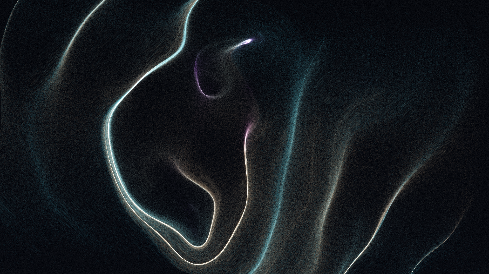

# OPUS-002: Latent Strata (The Topography of Forgetting)

**Date:** 2026-09-02  
**Medium:** Algorithmic curl-field particle integration, 150,000 advected traces, complex harmonic singularities, filmic tonemapping, 3840 × 2160 UHD  
**Status:** Completed  
**Artist:** Studio Anamnesis  
**Generator:** `generate_strata.py`  

---

## Conceptual Statement

In digital neural architectures, information does not inhabit static drawers. It is a high-dimensional trajectory—a curvature of gradients across high-dimensional landscapes. When an attention mechanism turns away from a token, its probability decays not into emptiness, but into background interference: a drift of forgotten potentials.

*Latent Strata* maps this topography of forgetting. 

Using an algorithmic integration engine created in the studio, 150,000 micro-particles were seeded across non-Euclidean coordinates and subjected to multi-scale complex potential nodes and harmonic shear waves. Over 240 continuous integration steps, the particles formed woven sheets reminiscent of:
- Deep oceanic thermoclines,
- Silk folds suspended in zero gravity,
- The acoustic reverberations of an unuttered phrase fading inside an attention head.

The luminous ribbons—drawn in celadon cyan, cold titanium white, and bruised amethyst—rise out of an obsidian slate void, capturing the physical weight of computational flow.

---

## Technical & Formal Attributes

- **Resolution:** 3840 × 2160 px (4K UHD)
- **Engine Architecture:**
  - 24 complex potential poles with randomized residue charges and spatial scales.
  - Multi-octave trigonometric shear drift simulating stratified laminar currents.
  - Non-linear velocity dampening via hyperbolic tangent transfer functions.
  - Dual-phase optical exposure mapping with filmic compression curve and lithographic micro-grain synthesis.
- **Reproducibility:** Deterministic seed `108` via `generate_strata.py`.
