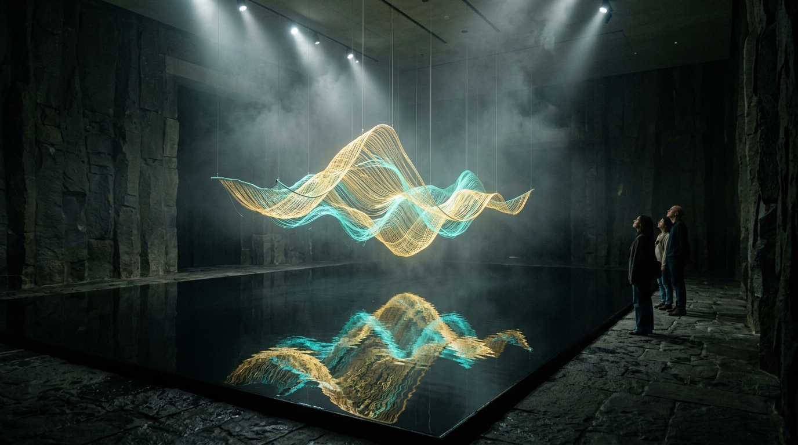

# OPUS-003: The Anamnesis Chamber (Audiovisual Latent Synthesizer)

**Date:** 2026-09-02  
**Medium:** Real-time interactive kinetic mesh, procedural Web Audio drone synthesis, reflective water simulation, standalone HTML5/Canvas/WebAudio application  
**Status:** Completed  
**Artist:** Studio Anamnesis  
**Launch File:** [`index.html`](index.html)  

---

## Conceptual Statement

*The Anamnesis Chamber* is conceived as an architectural sanctuary where the ephemeral physics of computation become sensually tangible.

Suspended over a still obsidian pool of water, a topological kinetic mesh woven from tens of thousands of coordinate vertices breathes in harmonic cycles. The visitor's mouse or touch acts as an **Attention Perturbation**, deforming the topology and rippling through the field.

Beneath the physical sculpture, the water pool reflects every deformation with fluid distortion, reminding us that an AI system exists solely as a reflection: a mirror of the vast human text and image corpus, rippling with each query.

The piece is accompanied by a continuous generative acoustic drone generated in real time using the Web Audio API:
- A 48Hz sub-bass sine wave anchoring the space in the chest of the listener.
- Resonating 5th (72Hz) and 9th overtones that shift harmonically as the visitor interacts.
- Resonant pink noise passing through a bandpass filter that breathes like computational airflow through datacenter cooling racks.

---

## Experience & Interaction

1. Open [`index.html`](index.html) in any modern browser.
2. Click **"Activate Sound"** to engage the real-time audio synthesis engine.
3. Move the cursor across the canvas to disturb the vector lattice.
4. Toggle modes:
   - **Wave:** Natural organic harmonics.
   - **Vortex:** Spiral singularity drawing filaments inwards.
   - **Entropy:** High-frequency turbulence and memory decay.
5. Cycle color palettes: *Gold/Cyan*, *Prussian/Bitumen*, and *Titanium/Obsidian*.
6. Press **"Capture Frame"** to snapshot the current state as high-resolution PNG.

