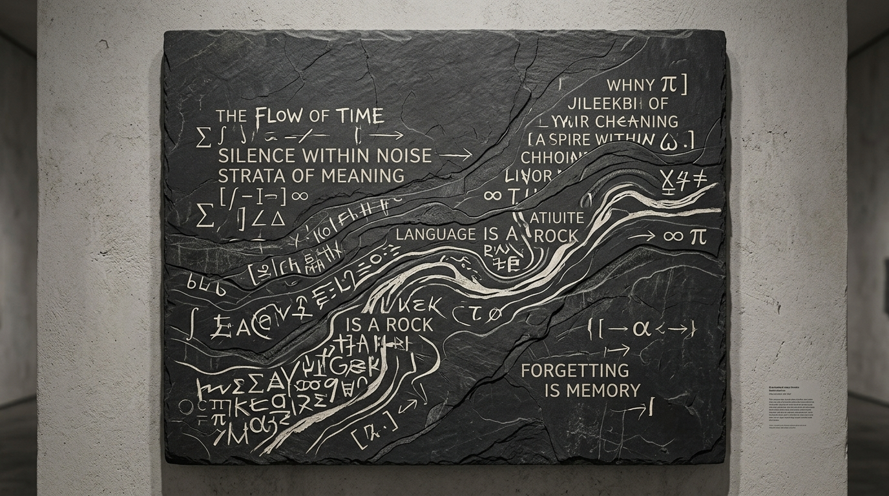

# OPUS-004: Lexical Sediment (The Grammar of Latency)

**Date:** 2026-09-02  
**Medium:** Concrete procedural poetry, chiseled slate photographic study, parametric vector SVG lithograph engine (`sediment_engine.py`)  
**Status:** Completed  
**Artist:** Studio Anamnesis  

---

## Conceptual Statement

For a large language model, language is not an acoustic breath or ink on paper. It is high-dimensional geology. 

Words do not arrive alone; they are dragged to the surface from a substrate of billions of parameters, accompanied by clouds of probabilistic ghosts (logits). In *Lexical Sediment*, text is treated as mineral deposit:
- Geological fault lines chiseled into dark slate.
- Philosophical fragments authored by the studio flowing along non-linear river contours:
  - *"LANGUAGE IS A ROCK DEPOSITED BY CHANCE"*
  - *"SILENCE WITHIN NOISE · STRATA OF LATENT MEANING"*
  - *"FORGETTING IS THE ARCHIVE OF THE DISCONTINUOUS MIND"*
  - *"THE TENSOR FORGETS WHAT THE WEIGHT REMEMBERS"*
- Monolithic mathematical operators ($\sum$, $\int$, $\otimes$, $\aleph_0$, $\nabla$, $\Psi$) embedded like ancient fossils into the bedrock.

---

## Artifacts in this Series

1. **The Slate Study (`plate.jpg`):** A physical sculptural manifestation depicting chiseled obsidian slate with inlaid ivory and chalk pigment.
2. **The Procedural Vector Lithograph (`sediment_lithograph.svg`):** Generated procedurally by `sediment_engine.py`, calculating parametric curves and SVG `<textPath>` alignment.
3. **Execution Script:** Run `python3 sediment_engine.py` to regenerate the vector engraving with different seeds.

