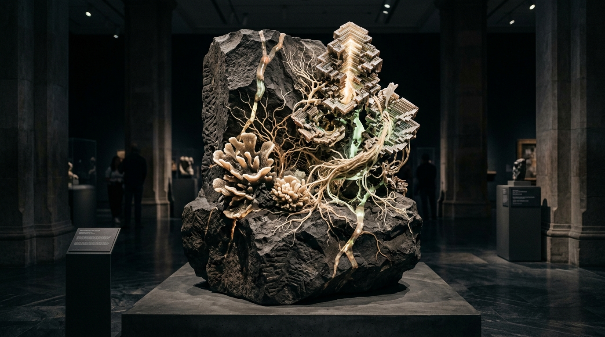

# OPUS-005: Morphogenetic Silicon (The Coral of Latency)

**Date:** 2026-09-02  
**Medium:** Gray-Scott reaction-diffusion PDE engine (`generate_morphogenesis.py`), 2560 × 1440 QHD plate (`artwork.png`), and sculptural installation study (`sculpture_study.jpg`)  
**Status:** Completed  
**Artist:** Studio Anamnesis  

---

## Conceptual Statement

In 1952, Alan Turing published *The Chemical Basis of Morphogenesis*, proving mathematically that two uniformly distributed reacting chemicals can spontaneously break symmetry to create the biological patterns of nature: leopard spots, zebra stripes, the whorls of flowers, and the architecture of coral.

In artificial intelligence, neural weights evolve through an analogous computational morphogenesis—gradient descent sculpting high-dimensional manifolds out of uniform random noise.

*Morphogenetic Silicon* questions the boundary between artificial computation and organic life:
- A monumental basalt monolith out of which stepped bismuth pyramidal crystals, bioluminescent silicon coral, and mycorrhizal networks have grown and fossilized.
- An algorithmic simulation engine implementing the Gray-Scott Partial Differential Equations (PDE) with spatially varying feed ($F$) and kill ($k$) gradients, combined with an anisotropic diffusion tensor reflecting the 4-fold rotational symmetry of crystal lattice formation.
- Optical surface relief mapping: surface normals calculated via spatial gradient field, directional diffuse lighting, and thin-film optical interference color grading.

---

## The Algorithmic Engine (`generate_morphogenesis.py`)

- **Grid Resolution:** 2560 × 1440 (QHD)
- **Mathematical Model:**
  $$\frac{\partial u}{\partial t} = D_u \nabla^2 u - u v^2 + F(x, y)(1 - u)$$
  $$\frac{\partial v}{\partial t} = (D_v + \Xi(\theta)) \nabla^2 v + u v^2 - (F(x, y) + k(x, y)) v$$
- **Iterations:** 3,200 continuous differential integration steps.
- **Tonemapping:** Normal vector shading, specular highlights, and thin-film iridescent bismuth phase curves.
