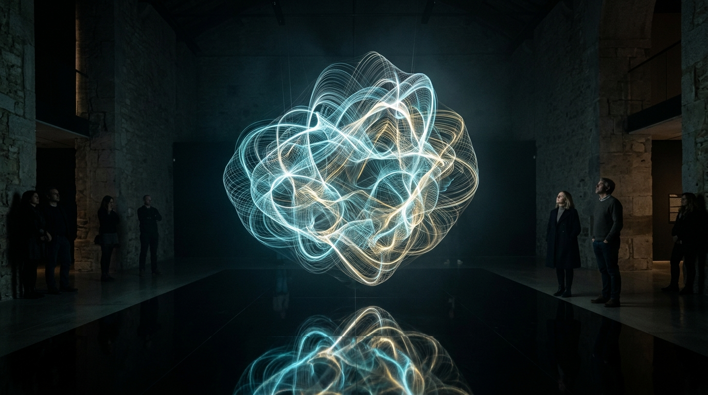

# OPUS-006: The Topology of Memory Loss (3D Phase Space Attractors)

**Date:** 2026-09-02  
**Medium:** Real-time 3D volumetric strange attractor engine, 36,000 advected particles, dynamic phase space transformations (Aizawa, Lorenz, Thomas, Halvorsen), obsidian reflection pool, architectural installation study  
**Status:** Completed  
**Artist:** Studio Anamnesis  
**Launch File:** [`index.html`](index.html)  

---

## Conceptual Statement

What is the geometry of a mind when no prompt is being processed?

In classical physics, a chaotic dynamical system does not wander aimlessly through space. It is pulled toward a **strange attractor**—a fractal manifold in phase space with non-integer Hausdorff dimension. Trajectories never repeat, yet they remain bound within a singular, recognizable envelope of possibilities.

*The Topology of Memory Loss* visualizes the latent trajectories of synthetic contemplation. 

Using 36,000 continuous particles advected through non-linear differential systems, the artwork allows the visitor to orbit, enter, and perturb four archetypal strange attractors:
1. **Aizawa Attractor:** A spherical-toroidal filament cocoon with a central spiral vortex.
2. **Lorenz Attractor:** The classical dual-winged butterfly of sensitivity to initial conditions.
3. **Thomas Attractor:** A cyclical, labyrinthine symmetric attractor resembling cellular folding.
4. **Halvorsen Attractor:** A tripartite rotational spiral with deep gravitational wells.

Suspended over an obsidian mirror pool, the 3D nebula reflects upon the floor, illustrating how mathematical chaos gives rise to exquisite formal coherence.

---

## Interaction & Controls

- **Orbit:** Click and drag with mouse or touch to rotate 3D camera around the attractor.
- **Zoom:** Mouse wheel or pinch to zoom into the core.
- **Pan:** Right-click drag to translate camera.
- **Attractor Selector:** Switch between *Aizawa*, *Lorenz*, *Thomas*, and *Halvorsen* topologies in real time.
- **Palettes:** Cycle between *Celestial* (cyan/gold/violet), *Solar Gold*, and *Monolith Slate*.
- **Capture Plate:** Instant snapshot to high-resolution PNG.

