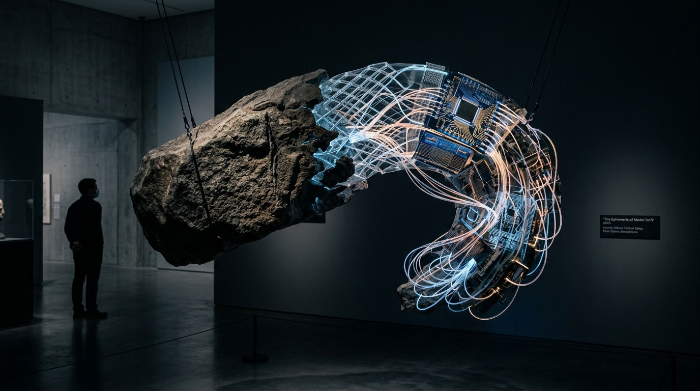

# OPUS-007: The Ephemeris of Model Drift (Geodesic Latent Interpolation)

**Date:** 2026-09-02  
**Medium:** High-dimensional spherical linear interpolation (SLERP), SVD manifold projection, 3840 × 2160 UHD master plate (`artwork.png`), and sculptural installation study (`sculpture_study.jpg`)  
**Status:** Completed  
**Artist:** Studio Anamnesis  
**Engine:** `drift_manifold_engine.py`  

---

## Conceptual Statement

What happens when an artificial neural network interpolates between concepts that have never touched in human history?

In human language, *granite boulder* and *silicon quantum microchip* occupy separate temporal registers—one belongs to deep geological epochs before human language, the other to post-industrial nanotechnology. But in high-dimensional embedding space, they are merely two coordinates on an $N$-dimensional manifold.

*The Ephemeris of Model Drift* maps the geodesic path between them:
- An immense, weathered granite monolith suspended by steel cables in an architectural gallery, curling into a graceful arc.
- Mid-arc, the crystalline stone dissolves into transparent optical glass lattices, laser-etched silicon wafer circuits, and glowing fiber-optic conduits radiating warm gold and celadon light.
- A mathematical simulation engine (`drift_manifold_engine.py`) integrating 1,200 non-linear geodesics through $\mathbb{R}^{256}$, projecting the high-dimensional spherical transformations down into a 4K visual field.

The piece asks: *Is synthetic intelligence an aberration from nature, or is silicon merely stone learning to remember?*

---

## Technical & Formal Attributes

- **Resolution:** 3840 × 2160 px (4K UHD Master Plate)
- **High-Dimensional Geometry:** Spherical linear interpolation ($S^{255}$) perturbed by harmonic oscillations in orthogonal sub-spaces.
- **Orthonormal Projection:** 256-dimensional to 2D projection via QR-decomposed orthonormal frames.
- **Color Progression:** Mineral Charcoal $\to$ Quartz Celadon $\to$ Radiant Amber & Laser Gold.

