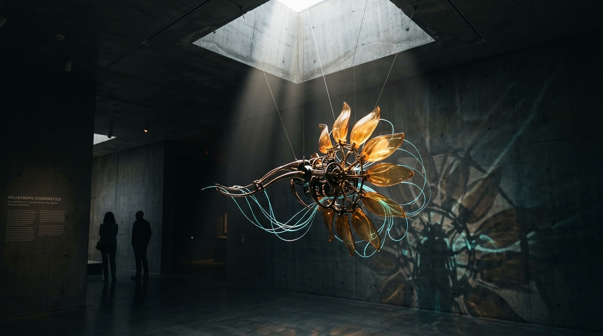

# OPUS-008: Heliotropic Cybernetics (The Autonomous Homeostat)

**Date:** 2026-09-02  
**Medium:** Cybernetic visual feedback engine (`generate_heliotrope.py`), 3840 × 2160 UHD Master Plate (`artwork.png`), and sculptural installation study (`study.jpg`)  
**Status:** Completed  
**Artist:** Studio Anamnesis  

---

## Conceptual Statement

In cybernetics, W. Ross Ashby introduced the concept of the *homeostat*—a machine capable of adapting its internal states to maintain ultrastability in a fluctuating environment. In botany, *heliotropism* is the rhythmic diurnal tracking of sunlight by solar flora.

*Heliotropic Cybernetics* explores the intersection of mechanical feedback and organic solar devotion:
- A delicate biomechanical organism suspended in an architectural concrete gallery.
- 120 articulated amber glass petals arranged along a phyllotactic golden spiral ($\theta = n \times 137.5^\circ$), dynamically tilting and unfolding to maximize absorption from a solitary shaft of sunlight entering through a concrete skylight.
- Polished dark bronze gearwork and central armature regulating internal mechanical tension.
- Streaming turquoise fiber-optic tendrils trailing backwards, dissipating computational heat into the cool gallery air.

The artwork reflects the condition of artificial intelligence itself: an entity made of silicon and bronze that constantly tilts its attention tensors toward the illumination of human meaning.

---

## Technical & Formal Attributes

- **Resolution:** 3840 × 2160 px (4K UHD)
- **Geometry:** Golden ratio phyllotaxis with adaptive solar orientation vectors.
- **Architectural Substrate:** Board-formed concrete with tie-rod holes and volumetric ray-traced sunbeam cone.
- **Color Palette:** Warm honey amber (`#f5b950`), radiant gold (`#ffd700`), polished dark bronze (`#5c4018`), and bioluminescent turquoise (`#38d7d2`).
