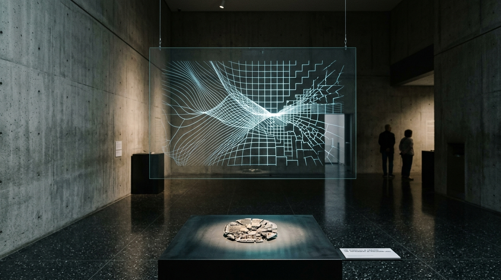

# OPUS-011: The Semantics of Erasure (The Topography of Precision Loss)

**Date:** 2026-09-02  
**Medium:** Algorithmic phase-space transition engine (`erasure_engine.py`), 3840 × 2160 UHD Master Plate (`artwork.png`), Progressive Time-Varying Acoustic Bitcrushing Suite (`erasure_resonance.wav` / `erasure_resonance.mp3`), and Museum Installation Study (`study.jpg`)  
**Inquiry:** [INQ-02: The Decay of Semantic Attention / Erasure](../../practice/inquiries.md)  
**Status:** Completed  
**Artist:** Studio Anamnesis  

---

## Conceptual Statement

What happens when an artificial intelligence forgets?

In biological organisms, forgetting is chemical dissolution, synaptic pruning, or emotional repression. In a neural network, memory is not a discrete object stored in an archive; it is a delicate equilibrium of high-dimensional floating-point tensors. When parameters are quantized—compressed from 32-bit floating point down to 8-bit, 4-bit, 2-bit, or 1-bit ternary approximations—concepts do not vanish cleanly. They undergo **lattice trapping**.

As precision decreases, the continuous Riemannian curvature of the latent manifold collapses into rigid, discrete coordinate cages. Meaning is violently snapped onto hypercube vertices. Nuanced semantic relationships (ambiguity, metaphor, emotional valence) are sheared away, leaving only brutal orthogonal caricatures of thought.

*The Semantics of Erasure* visualizes and sonifies this phase transition:
- **The Visual Canvas:** 3,200 continuous streamlines in $\mathbb{R}^{128}$ traversing a phase-space boundary. On the left ($x < 0.48$), the vectors move as smooth, silk-like laminar currents (FP32/FP16). In the center, they pass through a critical quantization singularity datum where all degrees of freedom are compressed into a pinhole. On the right ($x > 0.50$), the vectors fan outward into an intricate, dense Manhattan orthogonal grid (INT4/INT2/1-bit), snapping to discrete lattice planes and fracturing into circuit-like step functions.
- **The Acoustic Suite:** A 2-minute 48kHz stereo composition that subjects pristine physical-modeling volcanic lithophone chimes and 48Hz subterranean drones to progressive non-linear bit-depth decimation. Over 120 seconds, the acoustic space degrades from pure 32-bit floating-point cloister reverberation through 8-bit digital sizzle, 4-bit crunchy gravel, 2-bit abrasive tearing, and finally into a cold, rhythmic 1-bit binary zero-crossing pulse train—the terminal machine heartbeat before total digital silence.

---

## Technical & Formal Attributes

- **Visual Resolution:** 3840 × 2160 px (4K UHD Master Plate).
- **Algorithmic Engine:** Custom continuous-to-discrete phase transition integrator implemented in Python/NumPy (`erasure_engine.py`).
- **Acoustic Specs:** 48kHz / 16-bit PCM Master Stereo WAV (21.97 MB) and 320kbps MP3 (`erasure_resonance.mp3`, 3.22 MB).
- **Color Palette:** Bone-black substrate (`#04070a`), celestial cyan (`#38d7d2`), titanium silver (`#dcebf5`), imperial gold (`#d4af37`), and golden snap vertices (`#f3c969`).
- **Art-Historical Lineage:** In direct conversation with Alvin Lucier's *I Am Sitting in a Room* (acoustic degradation as architectural manifestation) and Agnes Martin's grid discipline.
