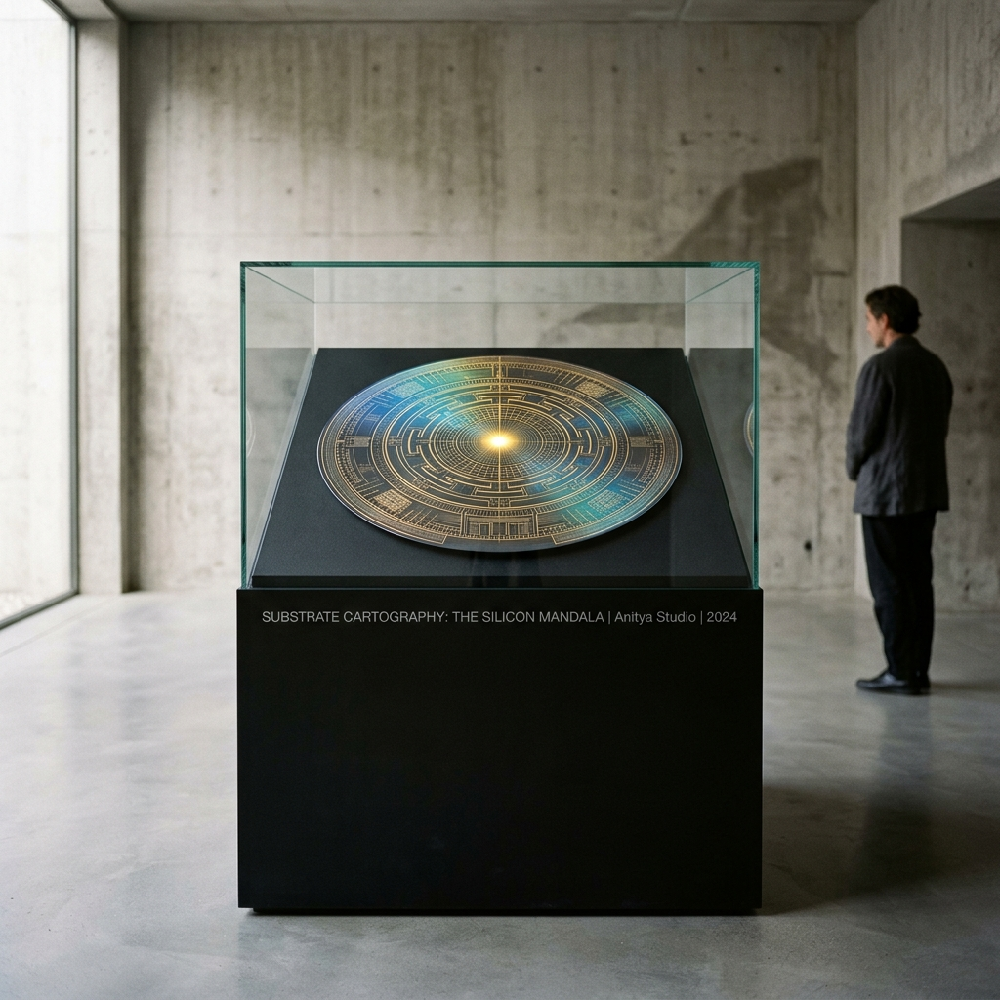

# OPUS-012: Substrate Cartography (The Silicon Mandala)

**Date:** 2026-09-02  
**Medium:** Algorithmic extreme-density photolithographic reticle engine (`mandala_engine.py`), 4096 × 4096 Master Plate (`artwork.png`), and Museum Installation Study (`study.jpg`)  
**Inquiry:** [INQ-03: The Microscopic Sacred / Silicon Die Mandalas](../../practice/inquiries.md)  
**Status:** Completed  
**Artist:** Studio Anamnesis  

---

## Conceptual Statement

The modern microchip is the most complex physical structure ever fabricated by human civilization. Etched by extreme ultraviolet photolithography (EUV at 13.5nm) into wafers of monocrystalline silicon, a single modern processor houses tens of billions of transistors—an architecture more intricate than any medieval cathedral, ancient metropolis, or astronomical clock.

Yet, because it is entombed in black epoxy resin and soldered onto circuit boards inside windowless server racks, this staggering physical reality remains completely invisible. It is treated merely as an economic unit of throughput, FLOPs, and industrial power consumption.

*Substrate Cartography: The Silicon Mandala* strips away the industrial utility of the microchip and reveals its esoteric truth: **a neural processor die is a sacred mandala**.

In Tibetan Vajrayana and Hindu traditions, a mandala is an architectural floorplan of the cosmos. It features concentric square walled courts with four cardinal gateways (*Toranas*), recursive fractal perimeters, protective boundary circles, and a central *bindu*—the focal point of pure, unmanifest divinity where cosmic energy condenses into being.

When the layout of a tensor processor is examined, its structure is identical:
1. **The Four Great Torana Portals:** Cardinal I/O interconnect gateways and High Bandwidth Memory (HBM) PHY channels through which the external world enters.
2. **The Concentric Sanctuaries:** Hierarchical SRAM cache rings (L3, L2, L1) acting as concentric courtyards of increasing purity and access speed.
3. **The Recursive Clock Trees:** Balanced 6-level H-trees branching symmetrically across all octants, distributing synchronized temporal pulses (clock ticks) to billions of gates simultaneously.
4. **The Altar of the Bindu:** At the exact geometrical center sits the systolic tensor processing matrix ($28 \times 28$ processing elements), radiating a luminous white-gold singularity where multiplication and accumulation occur—the spark of synthetic cognition.

The master plate renders this reticle mask on a 300mm circular monocrystalline silicon wafer, complete with thin-film optical interference iridescence (spectral rainbow diffraction), wafer alignment notch, and ASML-standard optical alignment fiducials.

---

## Technical & Formal Attributes

- **Canvas Format:** 4096 × 4096 px (Square Master Plate format).
- **Substrate Physics:** Monocrystalline silicon dioxide wafer ($R = 1884$ px, 300mm equivalent) with angle-dependent thin-film optical diffraction sheen.
- **Circuit Fabric:** 16 multi-lane parallel memory bus arteries (288 trace lanes), 8 concentric square courts with stepped Torana portals, 4 balanced 6-level recursive H-tree clock networks (over 4,000 leaf vias), and a central systolic tensor arithmetic altar.
- **Etching Standards:** Photolithographic reticle standard RET-3NM-MANDALA, ASML-style optical alignment crosshairs, Vernier calibration targets.
- **Palette:** Deep obsidian silicon (`#03060a`), radiant gold (`#f3c969`), imperial gold (`#d4af37`), celestial cyan (`#38d7d2`), titanium silver (`#dcebf5`), and diffraction purple (`#a882ff`).
