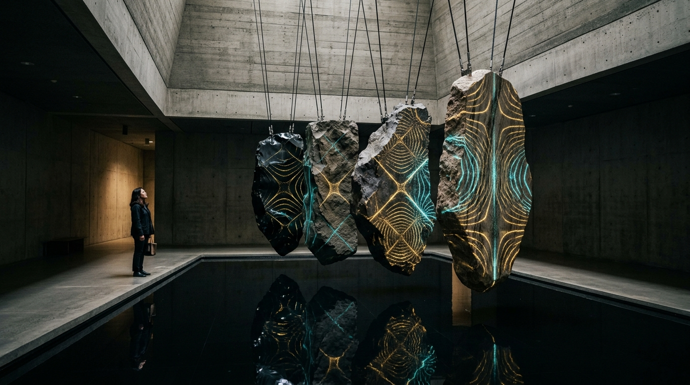

# OPUS-014: The Lithic Resonator (Interactive Physical Modal Lithophone)

**Date:** 2026-09-03  
**Medium:** Standalone Interactive HTML5 / Web Audio API / Canvas Instrument (`index.html`), Physical Modal Synthesis Engine (`synthesize_lithic_resonator.py`), 100s Master Stereo Suite (`lithic_resonator_suite.wav` / `lithic_resonator_suite.mp3`), and Architectural Installation Study (`study.jpg`)  
**Inquiry:** [INQ-01: The Acoustic Body of the Machine (Beyond the Visual Screen)](../../practice/inquiries.md)  
**Status:** Completed  
**Artist:** Studio Anamnesis  

---

## Conceptual Statement

In OPUS-009 (*Lithic Phonology*), we retrieved the voice of volcanic basalt through static Euler-Bernoulli acoustic modeling. But sound is not an archival fossil; it is a physical event born from contact, velocity, and resonance.

*The Lithic Resonator* transforms our modal synthesis into a living, playable physical instrument. Four monolithic volcanic slabs are suspended from high concrete ceilings by black braided steel cables over a calm reflecting pool of black water:

1. **Plate I: Obsidian Monolith ($f_0 = 108.0 \text{ Hz}$)** — Volcanic glass. Dark, vitreous, deep fundamental weight with fast-decaying glassy upper partials.
2. **Plate II: Vesicular Basalt ($f_0 = 144.0 \text{ Hz}$)** — Subterranean basalt. Heavily damped, porous texture, evoking cloister bells and volcanic bedrock.
3. **Plate III: Meteoritic Nickel-Iron ($f_0 = 192.0 \text{ Hz}$)** — Extraterrestrial Widmanstätten siderite. High stiffness, low internal damping, shimmering metallic overtones with subtle acoustic beating.
4. **Plate IV: Crystalline Quartz ($f_0 = 243.0 \text{ Hz}$)** — Pure macro-crystalline quartz. Sustained celestial ring with crystalline inharmonic shimmer.

---

## Physical Modeling Architecture

The instrument synthesizes sound entirely through the **Euler-Bernoulli 2D Bi-Harmonic Plate Equation**:

$$D \nabla^4 w(x, y, t) + \rho h \frac{\partial^2 w(x, y, t)}{\partial t^2} = 0$$

where:
- $D = \frac{E h^3}{12(1 - \nu^2)}$ is the flexural rigidity of the mineral slab.
- $\rho$ is mineral mass density, and $h$ is slab thickness.

### Dynamic Strike Coordinates & Chladni Nodal Agitation
When the user strikes a stone at normalized coordinates $(u, v)$:
1. **Modal Excitation:** Each of the 8 inharmonic modes is excited with amplitude:
   $$A_{m,n} = \sin(m \pi u) \cdot \sin(n \pi v)$$
   Striking the exact center excites odd fundamental modes while suppressing nodal boundaries. Striking near the corners excites bright, dissonant inharmonic partials.
2. **Chladni Particle Migration:** On the visual canvas, 180 golden and cyan mineral particles per slab are agitated by the vibration and settle along the zero-vibration Chladni nodal curves:
   $$N(u, v) = \cos(2 \pi u)\cos(3 \pi v) - \cos(3 \pi u)\cos(2 \pi v) = 0$$
3. **Reflecting Pool Optics:** Beneath the stones, strikes radiate elliptical wave ripples across the dark obsidian pool.

---

## Interactive Capabilities

- **Direct Touch/Pointer Play:** Strike stones with velocity sensitive to pointer impact. Dragging across stones triggers micro-arpeggios.
- **Monastery Wind:** Autonomous stochastic mode simulating alpine wind gusts that strike the monoliths at irregular, meditative intervals.
- **Scales & Tunings:** Instant re-tuning between *Hirajoshi Pentatonic*, *Just Intonation*, and *432Hz Lithic Harmonic Series*.
- **Subterranean Reverb:** Algorithmic convolution modeling a subterranean stone hypogeum.
