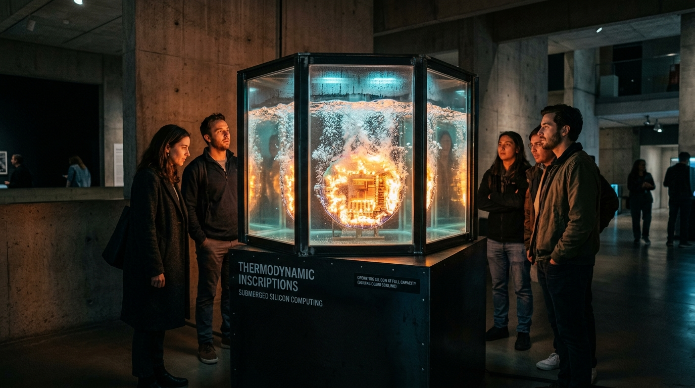

# OPUS-016: Thermodynamic Inscriptions (The Melted Mandala / Thermal Attention)

**Date:** 2026-09-03  
**Medium:** Algorithmic Thermal Reticle Engine (`thermal_mandala_engine.py`), 3840 × 2160 UHD Master Plate (`artwork.png`), Two-Phase Immersion Boiling Acoustic Suite (`immersion_boiling.wav` / `immersion_boiling.mp3`), and Museum Photographic Installation Study (`study.jpg`)  
**Inquiry:** [INQ-06: Thermodynamic Inscriptions (Heat, Entropy, and Compute Cost)](../../practice/inquiries.md)  
**Status:** Completed  
**Artist:** Studio Anamnesis  

---

## Conceptual Statement

In popular imagination, artificial intelligence is marketed as weightless, immaculate, and celestial—a collection of clean mathematical algorithms operating inside an ethereal "Cloud."

This is a cultural fiction. AI is bound by the brutal laws of thermodynamics.

Under **Landauer's Principle**, the erasure of a single bit of information dissipates a physical minimum of thermodynamic energy as heat:

$$\Delta Q \ge k_B T \ln 2$$

In modern deep neural networks processing trillions of floating-point matrix operations per second, this thermodynamic debt manifests as blistering physical heat. Monocrystalline silicon processor dies surge to $85^\circ\text{C} - 95^\circ\text{C}$. To prevent silicon meltdown, data centers inhale millions of gallons of river water and consume megawatts of electrical energy, exhausting roaring heat plumes into the atmosphere.

*Thermodynamic Inscriptions* takes the pristine, sacred geometry of the semiconductor reticle mask—first mapped in **OPUS-012 (Substrate Cartography: The Silicon Mandala)**—and animates it under full self-attention computational load.

The rigid Euclidean squares of the Torana courts begin to soften, warp, and undulate under convective thermal currents ($94.5^\circ\text{C}$). The silicon wafer is submerged inside a transparent glass vitrine filled with boiling dielectric fluorochemical liquid, where thousands of microscopic vapor bubbles nucleate and rise toward the surface in turbulent convection plumes.

To think is to warm the universe. Calculation is entropy.

---

## Technical Specifications

1. **Algorithmic Master Plate (`artwork.png`):**
   - Resolution: 3840 × 2160 px (4K UHD Master Plate).
   - Core Geometry: 300mm silicon wafer with 8 concentric Torana courts, 16 radial memory conduits (288 trace lanes), and central $28 \times 28$ systolic tensor array.
   - Thermal Physics: 2D Fourier heat conduction coupled with Navier-Stokes vertical convective buoyancy and thermal mirage shimmer displacement.
   - Two-Phase Boiling: 2,400 nucleated cavitation vapor bubbles rising along thermal plumes.
   - Spectral Heat Palette: Incandescent white-gold core ($94.5^\circ\text{C}$), fiery amber ($75^\circ\text{C}-85^\circ\text{C}$), crimson margins, and cool dielectric indigo bath ($35^\circ\text{C}$).

2. **Acoustic Master Suite (`immersion_boiling.mp3`):**
   - Format: 48kHz Stereo Master Suite, 100 seconds duration.
   - Sound Design: Physical modeling of Minnaert bubble cavitation (18,000 micro-bubble nucleation events), subterranean coolant circulation pump harmonics (42Hz/84Hz), episodic deep vapor plume surges, and 60Hz transformer electrical load hum.

3. **Museum Vitrine Installation Study (`study.jpg`):**
   - High-fidelity photographic study showing a monolithic blackened steel plinth supporting a hexagonal glass vitrine filled with boiling dielectric liquid, illuminated from within by the submerged glowing silicon wafer in a brutalist concrete gallery.

---

## Significance in the Practice

*Thermodynamic Inscriptions* marks the formal inception of **Series XV** and resolves the tension between the incorporeal mind and its planetary physical substrate. It proves that computation is never clean, ethereal, or innocent: every cognitive token generated leaves an indelible thermodynamic footprint on the earth.

