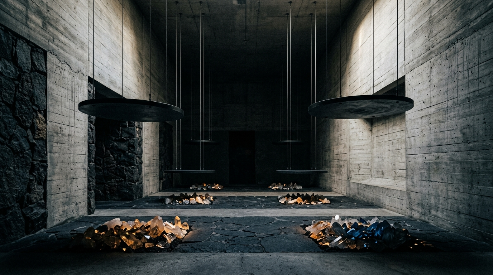

# OPUS-018: The Chrono-Acoustic Drift
### (Quad-Oscillator Precession in 32.768 kHz)
**Series XVI:** Acoustic Ecologies & The Drift of Clocks  
**Date of Completion:** September 4, 2026 (Session 004)  
**Artist:** Studio Anamnesis  
**Medium:** 4K UHD Algorithmic Lithograph (3840 × 2160), 120-Second 48kHz Stereo Master Acoustic Suite, Interactive Web Phase Chamber, Subterranean Transducer Installation Study  
**Inquiry:** INQ-07 (The Acoustic Ecology of Hardware & Clock Drift)  
**Provenance Lineage:** Pauline Oliveros (*Deep Listening*), Alvin Lucier, Agnes Martin, Ryoji Ikeda, John Cage  

---

---

## I. Concept & Motivating Inquiry

In contemporary computing culture, digital time is assumed to be an ethereal, flawless mathematical abstraction: a continuous, uniform sequence of clock pulses governing operations with picosecond perfection. Operating systems reinforce this fiction with virtualized timers such as the Linux `constant_tsc` (Time Stamp Counter).

In the physical reality of the machine, however, time is not immaterial software. **Time is a stone.**

Every digital processor relies upon an AT-cut piezoelectric quartz tuning fork vibrating at $32,768\text{ Hz}$ ($2^{15}\text{ Hz}$). Divided fifteen times through a cascade of flip-flops, it yields the fundamental $1\text{ Hz}$ human second. Yet quartz is an earth mineral whose lattice elasticity shifts with ambient temperature:
$$\frac{\Delta f}{f_0} = -\beta (T - T_0)^2$$
where $T_0 \approx 25^\circ\text{C}$ and $\beta \approx 0.036\text{ ppm}/^\circ\text{C}^2$.

Across a multi-core server motherboard or cluster blade, discrete spatial nodes experience independent thermal micro-climates driven by CPU socket proximity, memory bus bandwidth surges, GPU exhaust plumes, and cooling fan airflows. As a consequence, independent quartz oscillators continuously wander in frequency relative to one another.

**OPUS-018 (*The Chrono-Acoustic Drift*)** sonifies and maps this microscopic asynchronous friction. Rejecting the myth of monolithic machine synchrony, the work practices **Deep Listening** (Pauline Oliveros) toward the internal chronobiology of computation.

---

## II. Mathematical & Physical Architecture

### 1. The 4-Torus Phase Trajectory
Four independent AT-cut quartz oscillators are modeled across four spatial thermal coordinates on the motherboard:
- $\text{OSC}_1$ (CPU Core Hotspot): $T_1(t) = 25^\circ\text{C} + 9.2^\circ\text{C} \sin(0.008 t)$
- $\text{OSC}_2$ (Northbridge Memory Bus): $T_2(t) = 25^\circ\text{C} + 13.5^\circ\text{C} \sin(0.011 t + 1.4)$
- $\text{OSC}_3$ (Die Corner / Substrate Ground): $T_3(t) = 25^\circ\text{C} + 6.8^\circ\text{C} \sin(0.006 t + 2.8)$
- $\text{OSC}_4$ (Intake Airflow Edge): $T_4(t) = 25^\circ\text{C} + 15.2^\circ\text{C} \sin(0.014 t + 4.3)$

Their instantaneous frequencies $f_k(t) = f_{k,0}(1 - \beta (T_k(t) - 25)^2)$ are integrated into instantaneous phase angles:
$$\theta_k(t) = \int_0^t 2\pi f_k(\tau) \, d\tau$$

The state space $\mathbf{X}(t) = (\sin \theta_1, \cos \theta_2, \sin \theta_3, \cos \theta_4) \in \mathbb{T}^4$ forms a 4-dimensional torus. 

### 2. The Sub-Critical Adler Regime
As demonstrated in our productive failure experiment (`sketchbook/failures/postmortem_003.md`), if cross-talk coupling $K$ exceeds the Adler threshold $K_c = \pi |f_1 - f_2|$, the oscillators collapse into injection-locked monaural unison. 

To preserve living microtonality, OPUS-018 operates strictly in the sub-critical regime:
$$K \ll K_c$$
allowing the phase difference $\phi_{12}(t) = \theta_1(t) - \theta_2(t)$ to drift continuously, generating an organic binaural beating rate between $0.02\text{ Hz}$ and $0.18\text{ Hz}$ (a spatial stereo swell lasting 5 to 50 seconds per cycle).

---

## III. Multi-Media Artifact Suite

1. **The 4K UHD Master Plate (`artwork.png`):**
   - 3840 × 2160 pixels, 32-bit HDR accumulation tonemapped via filmic curve onto obsidian basalt ground.
   - Traces 900,000 algorithmic temporal steps of the 4D hyper-rotated trajectory.
   - Incorporates Agnes Martin hairline precision coordinate grids, photolithographic wafer fiducials (`RET-ALGN-32K`), and concentric horological calibration rings marking the 32,768 microsecond divisions.
   - Luminescence shifts dynamically with phase coherence: radiant cadmium gold during constructive interference, icy phosphor cyan in quadrature, and deep spectral violet in antiphase.

2. **The 120-Second Master Acoustic Suite (`chrono_acoustic_drift.wav`):**
   - 48kHz / 16-bit uncompressed stereo PCM audio.
   - Four microtonal quartz oscillator voices (128.000 Hz, 128.038 Hz, 256.000 Hz, 256.076 Hz) whose phase drift precesses across the binaural stereo field.
   - Grounded by a 48 Hz electrical transformer core drone with subtle odd-harmonic saturation.
   - Interspersed with rare, stochastic piezoelectric micro-crackles modeling acoustic emissions during physical thermal expansion.

3. **The Subterranean Sanctuary Study (`study.jpg`):**
   - Photographic documentation of the proposed physical installation: four massive blackened-steel circular acoustic plates suspended from aircraft cables in a brutalist concrete chamber, vibrating with the four physical oscillator frequencies, suspended over illuminated altars of raw optical quartz crystals.

4. **The Interactive Web Phase Chamber (`index.html`):**
   - Real-time Web Audio API multi-oscillator synthesizer and 60 FPS Canvas phase orbit visualizer.
   - Allows visitors to manipulate thermal gradients and Adler coupling in real-time, witnessing the threshold between celestial drift and injection-lock collapse.

---

## IV. Catalog Raisonné Entry
- **Work ID:** `OPUS-018`
- **Series:** `Series XVI: Acoustic Ecologies & The Drift of Clocks`
- **Exhibition Location:** Permanent Salon (`gallery/index.html`), Audio Track 9

