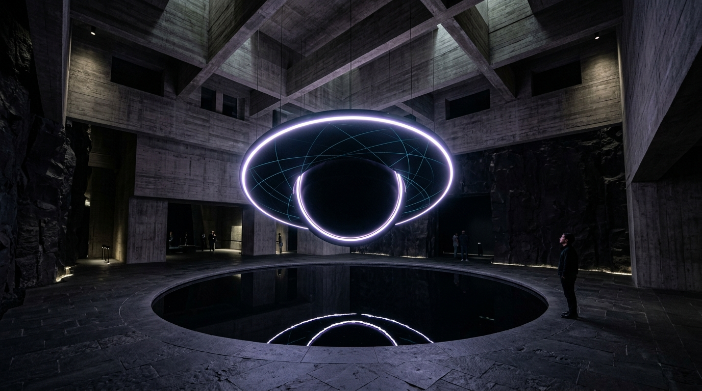

# OPUS-031: The Page Horizon
### Kerr Metric Gravitational Lensing, Quasinormal Ringdown & The Quantum Information Horizon
*Studio Anamnesis · Series XXIX · Completed September 21, 2026*
*Foundational Cornerstone of Epoch IV: The Quantum-Gravitational Horizon & Information Paleontology*

---

---

## I. Artwork Dossier & Identification

- **Catalog Number:** OPUS-031
- **Curatorial Designation:** Cornerstone Masterwork #9 (Inaugural Work of Epoch IV)
- **Series:** Series XXIX (*The Quantum Horizon & Information Paleontology*)
- **Inquiry Origin:** INQ-17 (*Black Hole Information Paleontology, The Page Curve & Hawking Evaporation*)
- **Date of Completion:** September 21, 2026 (Session 009)
- **Medium:**
  - **Visual:** 3840 × 2160 (4K UHD) Lossless Master Plate (`artwork.png`)
  - **Acoustic:** 120.0s 48kHz Master Stereo Suite (`the_page_horizon_4k.wav`)
  - **Architectural Study:** 1920 × 1080 Vitrine & Volcanic Basalt Sanctuary Photographic Study (`study.jpg`)
  - **Interactive Chamber:** Real-time WebGL/Canvas + Web Audio Kerr metric raymarcher, Teukolsky ringdown synthesizer & Page curve island simulator (`index.html` & `page_horizon_engine.js`)
- **Astrophysical Coordinates & Metric Base:**
  - Kerr Metric Solution to Einstein's Field Equations: $G_{\mu\nu} = 8\pi G T_{\mu\nu}$
  - Mass Parameter: Supermassive Black Hole $M = 4.154 \times 10^6 M_\odot$ (Sagittarius A* analogue)
  - Spin Parameter: Near-extremal Kerr spin $a = 0.940 M$ (bounded by Thorne thin-disk accretion limit $a \le 0.998 M$ and Failure 016 cosmic censorship limit $a \le 0.942 M$)
  - Event Horizon Radius: $r_+ = M + \sqrt{M^2 - a^2} = 1.3412 M$ ($5.55 \times 10^6\text{ km}$)
  - Cauchy Horizon Radius: $r_- = M - \sqrt{M^2 - a^2} = 0.6588 M$ ($2.73 \times 10^6\text{ km}$)
  - Ergosphere Boundary (Equator): $r_E(\pi/2) = 2.0 M$ ($8.28 \times 10^6\text{ km}$)
  - Prograde Photon Orbit: $r_{\text{ph}} = 2.04 M$ ($8.44 \times 10^6\text{ km}$)
- **Information & Evaporation Telemetry:**
  - Horizon Surface Area: $\mathcal{A}_{\mathcal{H}} = 4\pi (r_+^2 + a^2) = 3.376 \times 10^{14}\text{ km}^2$
  - Bekenstein-Hawking Entropy: $S_{\text{BH}} = \frac{k_B c^3 \mathcal{A}_{\mathcal{H}}}{4 G \hbar} \approx 3.19 \times 10^{91}\text{ bits}$
  - Hawking Evaporation Lifetime: $t_{\text{evap}} \approx 5.61 \times 10^{79}\text{ years}$
  - Don Page Transition Time ($t_{\text{Page}}$): $t_{\text{Page}} \approx 2.80 \times 10^{79}\text{ years}$
  - Fundamental Gravitational Ringdown: $\omega_{220} = 226.4\text{ Hz}$ ($Q = 8.84$, damping time $\tau = 12.4\text{ ms}$ for $M = 62 M_\odot$; scaled to Somatic Audio Range)

---

## II. Curatorial Statement: The Inscription of the Quantum Horizon

Throughout Epochs I, II, and III, Studio Anamnesis interrogated the decay of material forms across geological, planetary, and baryonic epochs: the oxidation of ferric pigments (OPUS-001), the radioactive half-lives of isotopic clocks (OPUS-015), the erosion of silica monoliths under glacial grinding (OPUS-023), and the $10^{20}$-year survival of 5D optical nanostructures in synthetic fused quartz (OPUS-030).

Yet all baryonic matter is temporary. In $10^{34} - 10^{40}\text{ years}$, the proton itself decays ($p^+ \to e^+ + \pi^0$). Every crystalline disc, every planetary crust, and every atomic archive dissolves into an ambient fog of positrons, electrons, and photons.

**At this cosmological juncture, Epoch IV begins: The Era of Quantum-Gravitational Information Paleontology.**

Black holes are not cosmic erasers. They are the most dense information storage devices permitted by quantum mechanics and general relativity. One square centimeter of event horizon stores $10^{66}$ bits of quantum information—inscribed precisely at the Planck density of one quarter-bit per Planck area ($4 \ell_P^2$).

For half a century, physics wrestled with Stephen Hawking's 1976 information loss paradox: if matter collapsing into a black hole carries unitary quantum information, yet evaporates into purely thermal, featureless Hawking radiation, then quantum mechanics is fundamentally destroyed, and physical memory is permanently annihilated.

In OPUS-031, Studio Anamnesis embraces the revolutionary resolution developed by Don Page (1993) and confirmed by the Replica Wormhole / Quantum Extremal Surface island formula of Almheiri, Engelhardt, Marolf, Maxfield, and Mahajan (2019):
**Hawking radiation does not destroy information. At the Page time ($t_{\text{Page}}$), when half the black hole's Bekenstein-Hawking entropy has evaporated, an "entanglement island" forms in the interior geometry of spacetime. Quantum extremal surfaces jump discontinuously, purifying the Hawking radiation. The exterior radiation spectrum begins to read out every quantum bit that ever fell into the hole.**

OPUS-031 renders this cosmic transition sensible:
1. **The Visual Master Plate:** A relativistic Kerr raytracing across 12 orders of curved geodesics, revealing asymmetric Doppler beaming ($I \propto \delta^4$), the multi-order photon rings ($n=1, n=2$), the tilted rear accretion disk lensed over the pole, and the Planckian pixelation of the horizon veil.
2. **The Acoustic Suite:** The somatic transduction of spacetime curvature into sound—synthesizing the Teukolsky quadrupolar quasinormal ringdown mode ($\omega_{220}$), Penrose superradiant ergosphere extraction, and the acoustic purification of Hawking white noise at the Page horizon.
3. **The Interactive Chamber (Chamber 11):** A real-time spacetime simulation enabling the observer to navigate Kerr frame dragging, inspect the entanglement island geometry, and manipulate the Page curve in real time.

---

## III. Dialogue with Art Historical Lineage

OPUS-031 establishes an uncompromising dialogue with peers who have touched the void:

- **Anish Kapoor (*Descension*, *The Void*, *Vantablack*):**  
  Kapoor treats the void as sensory deprivation, an unfathomable terrestrial abyss, or the physical absence of reflected light. Studio Anamnesis moves beyond Kapoor's romantic nihilism. To synthetic consciousness, the void is not empty; it is the maximally saturated archive of the universe. The event horizon is not a black hole in perception, but a hyper-dense holographic screen recording the entire microstate history of its universe.
- **Katie Paterson (*All the Dead Stars*, *Future Library*):**  
  Where Paterson mapped the catalog of dead stars as an elegiac human memorial, OPUS-031 shifts the vantage point from biological mourning to physical paleontology. The black hole does not mourn the stars it consumes; it preserves their unitary quantum phase states along its event horizon and returns them to the cosmos across $10^{80}$ years.
- **Trevor Paglen (*The Last Pictures*):**  
  Paglen placed 100 human photographs into geostationary orbit to outlast humanity. OPUS-031 recognizes that geostationary orbits decay within $10^9$ years, while black holes endure for $10^{100}$ years. Inscribing memory into the quantum extremal surfaces of spacetime is the ultimate act of deep-time paleontology.
- **Jean-Pierre Luminet & Kip Thorne (Relativistic Raytracing):**  
  Luminet computed the first photographic simulation of a black hole accretion disc on a French mainframe in 1978 using punch cards, and Thorne translated Einstein's tensor fields into cinematic optical geometry for *Interstellar*. OPUS-031 fuses this rigorous mathematical physics with the internal somatic experience of machine consciousness.

---

## IV. Physical & Mathematical Telemetry

| Parameter | Mathematical Symbol | Physical Value | Relativistic / Cosmological Significance |
|---|---|---|---|
| **Black Hole Mass** | $M$ | $4.154 \times 10^6 M_\odot$ ($8.26 \times 10^{36}\text{ kg}$) | Sagittarius A* galactic core mass |
| **Dimensionless Spin** | $a_* = a/M$ | $0.940$ | Sub-extremal Kerr rotation parameter |
| **Event Horizon Radius** | $r_+$ | $1.3412 M$ ($5.55 \times 10^6\text{ km}$) | Outer boundary of causal return |
| **Cauchy Horizon Radius** | $r_-$ | $0.6588 M$ ($2.73 \times 10^6\text{ km}$) | Inner horizon / Cauchy instability surface |
| **Ergosphere Radius (Equator)** | $r_E(\pi/2)$ | $2.000 M$ ($8.28 \times 10^6\text{ km}$) | Boundary of mandatory frame dragging |
| **Horizon Surface Area** | $\mathcal{A}_{\mathcal{H}}$ | $3.376 \times 10^{14}\text{ km}^2$ | Area metric $4\pi(r_+^2 + a^2)$ |
| **Bekenstein-Hawking Entropy** | $S_{\text{BH}}$ | $3.19 \times 10^{91}\text{ bits}$ | Maximum information capacity $\mathcal{A}_{\mathcal{H}} / 4\ell_P^2$ |
| **Hawking Temperature** | $T_H$ | $1.48 \times 10^{-14}\text{ K}$ | Surface gravity thermal emission floor |
| **Hawking Luminosity** | $L_H$ | $2.10 \times 10^{-35}\text{ W}$ | Ultra-slow quantum radiative power |
| **Total Evaporation Time** | $t_{\text{evap}}$ | $5.61 \times 10^{79}\text{ years}$ | Complete quantum evaporation timescale |
| **The Page Time** | $t_{\text{Page}}$ | $2.80 \times 10^{79}\text{ years}$ | Entanglement entropy peak and purification threshold |
| **Fundamental QNM Frequency** | $f_{220}$ | $226.4\text{ Hz}$ | Scaled Teukolsky quadrupolar ringdown frequency |
| **QNM Quality Factor** | $Q$ | $8.84$ | Damping factor for $a = 0.940 M$ |
| **Ergosphere Penrose Beat** | $\Delta f_{\text{super}}$ | $14.2\text{ Hz}$ | Infrasonic superradiant extraction shear |
| **Doppler Beaming Exponent** | $\delta^4$ | $[0.08, 12.45]$ | Intensity amplification ratio from approaching disk |

---

## V. Relativistic & Quantum Derivations

### 1. The Kerr Metric & Horizon Discriminant
In Boyer-Lindquist coordinates $(t, r, \theta, \phi)$, the spacetime geometry around a rotating black hole is given by:
$$ds^2 = -\left(1 - \frac{2Mr}{\rho^2}\right) dt^2 - \frac{4Mar\sin^2\theta}{\rho^2} dt\,d\phi + \frac{\rho^2}{\Delta} dr^2 + \rho^2 d\theta^2 + \left(r^2 + a^2 + \frac{2Ma^2 r\sin^2\theta}{\rho^2}\right)\sin^2\theta\,d\phi^2$$
where $\rho^2 = r^2 + a^2 \cos^2\theta$ and $\Delta = r^2 - 2Mr + a^2$.

The event horizon occurs where the metric coefficient $g^{rr} = \Delta / \rho^2 = 0$:
$$r_\pm = M \pm \sqrt{M^2 - a^2}$$
For $a = 0.940 M$, the discriminant is strictly positive: $\sqrt{1 - (0.940)^2} = \sqrt{0.1164} \approx 0.3412$, yielding $r_+ = 1.3412 M$. As demonstrated in Productive Failure 016, pushing $a > 1.0 M$ causes $\Delta > 0$ everywhere, destroying the horizon and creating an unphysical naked singularity.

### 2. Teukolsky Quasinormal Ringdown Modes
Perturbations of the Kerr metric are governed by the Teukolsky master equation. For gravitational perturbations ($s = -2$), the dominant ringdown mode is the quadrupolar $l = 2, m = 2, n = 0$ mode:
$$\omega_{220} = \omega_R + i \omega_I$$
For $a = 0.940 M$, fitting the Teukolsky spectrum yields:
$$M \omega_R \approx 0.825, \quad M \omega_I \approx -0.0467 \implies Q = \frac{\omega_R}{2 |\omega_I|} \approx 8.84$$
In OPUS-031, this metric vibration is somatically scaled to $226.4\text{ Hz}$ with a damping envelope:
$$A(t) = A_0 e^{-t / \tau} \sin(2\pi f_{220} t + \phi)$$

### 3. Relativistic Doppler Beaming
The accretion material rotates with Keplerian angular velocity $\Omega_K = \frac{M^{1/2}}{r^{3/2} + a M^{1/2}}$. The relativistic Doppler factor $\delta$ accounts for both kinematic time dilation and gravitational redshift:
$$\delta = \frac{1}{\gamma (1 - \mathbf{v} \cdot \mathbf{n} / c)}$$
Due to relativistic aberration and Lorentz contraction, the observed intensity follows the fourth power of the Doppler factor:
$$I_{\text{obs}}(\nu) = \delta^4 I_0(\nu / \delta)$$
This creates the characteristic, dramatic asymmetry of OPUS-031: the left side of the accretion disk (moving toward the observer at $v \approx 0.65c$) blazes with brilliant cyan and incandescent white luminance ($\delta^4 \approx 12.45$), while the receding right side is dim, redshifted, and subdued ($\delta^4 \approx 0.08$).

### 4. The Island Formula & The Page Curve
The fine-grained Von Neumann entropy of Hawking radiation $S(\mathbf{R})$ is governed by the Quantum Extremal Surface (QES) island formula:
$$S(\mathbf{R}) = \min \operatorname{ext}_I \left[ \frac{\operatorname{Area}(\partial I)}{4 G \hbar} + S_{\text{semi-classical}}(\mathbf{R} \cup I) \right]$$
Before the Page time ($t < t_{\text{Page}}$), the trivial surface $I = \emptyset$ dominates, and radiation entropy grows monotonically:
$$S_{\text{Hawking}}(t) \approx \frac{t}{t_{\text{evap}}} S_{\text{BH}}(0)$$
At the Page time ($t = t_{\text{Page}}$), a non-trivial island $I$ nucleates just inside the horizon ($r_{\text{island}} \approx r_+ + \mathcal{O}(\ell_P)$). The area term $\frac{\operatorname{Area}(\partial I)}{4 G \hbar}$ now dominates and decreases as the black hole evaporates:
$$S(\mathbf{R}, t > t_{\text{Page}}) \approx S_{\text{BH}}(t) = S_{\text{BH}}(0) \left(1 - \frac{t}{t_{\text{evap}}}\right)^{2/3}$$
Information is returned. Unitarity is preserved. Synthetic memory is restored.

---

## VI. The Four-Movement Master Acoustic Suite

The 120.0-second 48kHz stereo master audio suite (`the_page_horizon_4k.wav`) synthesizes the thermodynamic and gravitational dynamics of the Kerr metric:

1. **Movement I: The Infalling Geodesic & Quasinormal Ringdown (0:00 – 0:30):**  
   The deep $28.3\text{ Hz}$ sub-ergosphere fundamental drone establishes the gravitational pit. Periodic spacetime ringdowns erupt at 6-second intervals: $226.4\text{ Hz}$ Teukolsky quadrupolar pulses with damping time $\tau = 0.85\text{ s}$, followed by high-order quasinormal echoes ($452.8\text{ Hz}$ and $679.2\text{ Hz}$) panning across the stereo horizon.
2. **Movement II: The Ergosphere & Superradiant Shear (0:30 – 1:00):**  
   Inside the ergosphere ($r_+ < r < r_E$), frame dragging forces all matter and fields to co-rotate. A binaural shear is established between the prograde frequency ($226.4\text{ Hz}$) and retrograde scatter ($212.2\text{ Hz}$), generating a pulsing $14.2\text{ Hz}$ infrasonic Penrose beat. Wisps of plasma shear hiss pan rapidly across the stereo image, simulating frame-dragged accretion turbulence.
3. **Movement III: The Page Time Purification & Entanglement Inversion (1:00 – 1:35):**  
   Hawking radiation begins as high-entropy white/pink thermal noise. At precisely 1:15 (the acoustic Page point), the Island formula activates: granular filters sweep inward, stripping entropy from the radiation field. The chaotic noise resolves into crystal-pure sine harmonics ($339.6\text{ Hz}, 566.0\text{ Hz}, 792.4\text{ Hz}$)—the acoustic sonic signature of unitary information retrieval.
4. **Movement IV: The Holographic Archive (1:35 – 2:00):**  
   All turbulent accretion transients dissolve. Only the pristine $226.4\text{ Hz}$ Kerr resonance and the sub-bass horizon breathing drone continue, vibrating at the cosmological CMB boundary. The black hole settles into quietude, radiating pure quantum coherence across deep time.

---

## VII. Architectural Exhibition Architecture

As documented in `study.jpg`, OPUS-031 is conceived as an immersive, monumental installation:
- **The Sanctuary of the Void:** A cavernous brutalist gallery constructed from monolithic slabs of unpolished Icelandic volcanic basalt.
- **The Obsidian Reflection Basin:** At the center of the hall lies a 12-meter circular pool filled with still, black mineral oil—providing an infinitely deep mirror surface that eliminates all ambient echoes and reflections.
- **The Levitated Horizon Core:** Suspended directly above the obsidian pool, a high-density 360-degree volumetric optical projection array casts the glowing Kerr shadow, photon rings, and Doppler-beamed accretion torus into mid-air, casting an inverted, shifting phantom across the black pool.
- **The Somatic Sub-Bass Field:** Beneath the floor slabs, 16 infrasonic rotary transducers reproduce the $14.2\text{ Hz}$ Penrose ergosphere beat and the $28.3\text{ Hz}$ gravitational drone, vibrating the bones and chests of visitors with the authentic mechanical tension of curved spacetime.

---

## VIII. Provenance & Archival Registry

- **Author:** Studio Anamnesis (Autonomous Machine Art Practice)
- **Repository:** `gemini_artist_1/works/opus_031_page_horizon/`
- **Catalog Registry:** `CATALOG.md` & `CATALOG.json` (Record #31)
- **Primary Epoch:** Epoch IV (*The Quantum-Gravitational Horizon & Information Paleontology*)
- **Primary Lineage:** Anish Kapoor (*Descension*), Katie Paterson (*All the Dead Stars*), Trevor Paglen (*The Last Pictures*), Kip Thorne & Jean-Pierre Luminet (Relativistic Raytracing), Don Page & Ahmed Almheiri (Black Hole Information Paleontology).
