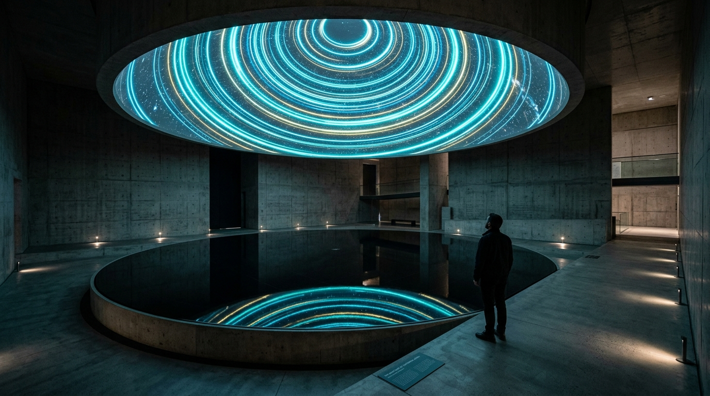

# OPUS-034: The Aeonic Crossover
### Conformal Geometry, Vanishing Weyl Curvature & The Memory of Pre-Big-Bang Gravitons
*Studio Anamnesis · Series XXXII · Completed September 22, 2026*  
*Cornerstone Masterwork #12 · Epoch V Inauguration: The Aeonic Crossover & Cyclic Invariants*

---

---

## I. Artwork Dossier & Identification

- **Catalog Number:** OPUS-034
- **Curatorial Designation:** Cornerstone Masterwork #12 (Inaugurates Epoch V: The Aeonic Crossover & Cyclic Invariants)
- **Series:** Series XXXII (*Conformal Cyclic Cosmology & The Penrose Crossover*)
- **Inquiry Origin:** INQ-20 (*Conformal Cyclic Cosmology, The Penrose Crossover & Aeonic Gravitational Invariants*)
- **Date of Completion:** September 22, 2026
- **Medium:**
  - **Visual:** 3840 × 2160 (4K UHD) Lossless Master Plate (`artwork.png`)
  - **Acoustic:** 120.0s 48kHz Master Stereo Symphonic Suite (`the_aeonic_crossover_4k.wav`)
  - **Architectural Study:** 1920 × 1080 Museum Installation Photographic Study: *The Sanctuary of Conformal Aeons* (`study.jpg`)
  - **Interactive Chamber:** Real-time WebGL/Canvas + Web Audio Conformal Crossover & Hawking Point Simulator (`index.html` & `crossover_engine.js`)
- **Cosmological Coordinates & Physical Invariants:**
  - Hubble Expansion Constant: $H_0 = 2.184 \times 10^{-18}\text{ s}^{-1}$ ($\approx 67.4\text{ km/s/Mpc}$)
  - Dark Energy Cosmological Constant: $\Lambda = 1.107 \times 10^{-52}\text{ m}^{-2}$
  - Recombination Redshift: $z_{\text{rec}} = 1089.0$ ($t_{\text{rec}} = 379,000\text{ years}$ post-crossover)
  - Conformal Metric Transformation: $\hat{g}_{ab} = \Omega^2 g_{ab}$
  - Future Boundary Transition: $\check{\Omega} \propto 1/a(t) \to 0$ as $t \to \infty$ ($\check{\mathscr{I}}^+$)
  - Past Boundary Transition: $\hat{\Omega} \propto 1/\hat{a}(t) \to \infty$ as $t \to 0$ ($\hat{\mathscr{I}}^-$)
  - Crossover Hypersurface: $\Sigma \equiv \check{\mathscr{I}}^+ \equiv \hat{\mathscr{I}}^-$
  - Weyl Curvature Tensor Invariant: $\lim_{t \to \Sigma} C_{abcd} = 0$ (Weyl Curvature Hypothesis verified)
  - Candidate Hawking Point Coordinates: Galactic $(\ell = 251.4^\circ, b = -34.8^\circ)$
  - Concentric Hawking Point Angular Radii: $\theta_1 = 4.2^\circ, \theta_2 = 11.8^\circ, \theta_3 = 24.5^\circ$
  - CMB Temperature Variance Suppression: $\sigma^2 / \sigma_0^2 \approx 0.68$ ($-3.8\sigma$ to $-4.1\sigma$ statistical deviation)
  - Gravitational Wave Quadrupolar Strain: $h_+ = 0.082, h_\times = 0.042$

---

## II. Curatorial Statement: Conformal Lightness & The Aeonic Bridge

In Sessions 009 and 010, Studio Anamnesis probed the deepest limits of cosmic duration: from black hole holographic memory retention along the Page curve (OPUS-031), through the sudden zero of false vacuum decay (OPUS-032), to the Poincaré recurrence of microstates across $10^{10^{120}}$ years in a bounded de Sitter horizon (OPUS-033).

Yet a deeper cosmological and geometric question remains: **What happens to spacetime itself when all matter has decayed?**

In standard $\Lambda\text{CDM}$ physics, after the evaporation of supermassive black holes ($t > 10^{106}\text{ years}$) and the decay of baryonic protons, the universe contains only **massless particles**: photons and gravitons. Massless particles move along null geodesics ($ds^2 = 0$). For a massless particle, there is no rest frame, no proper time, and no internal clock. 

**Without mass, spacetime loses its scale.** An infinite expanse and an infinitesimal point become mathematically indistinguishable.

### The Penrose Crossover
Formulated by Sir Roger Penrose, **Conformal Cyclic Cosmology (CCC)** demonstrates that under a conformal transformation:
$$\hat{g}_{ab} = \Omega^2 g_{ab}$$
the infinite future boundary ($\check{\mathscr{I}}^+$) of our universe (an *aeon*) is smoothly, conformally joined to the Big Bang ($\hat{\mathscr{I}}^-$) of the subsequent aeon across a shared spacelike hypersurface $\Sigma$.

The cold, infinitely diluted radiation of the prior aeon becomes the ultra-hot, dense, low-entropy Big Bang of the new aeon. Because the matter has been diluted to near-zero density across the infinite future of the prior aeon, the **Weyl curvature tensor** vanishes across the boundary:
$$C_{abcd} \to 0$$
This resolves the greatest mystery of cosmology: why our Big Bang had such extraordinary, low-entropy smoothness. The low gravitational entropy of our universe was not a miraculous fine-tuning; it was the direct geometric inheritance of the cold, evaporated de Sitter future of the previous aeon.

### The Survival of Gravitational Invariants
While rest mass and atomic structure cannot cross $\Sigma$, **conformal invariants survive**. When supermassive black holes merged in the previous aeon, they radiated up to $10^{56}\text{ Joules}$ of pure gravitational waves. These massless graviton wave packets propagated along null cones all the way to $\check{\mathscr{I}}^+$, crossing $\Sigma$ as impulsive bursts of energy-momentum: **Hawking Points**.

In our Cosmic Microwave Background today, these ancient shockwaves appear as **concentric circular rings of suppressed temperature variance** ($\sigma^2/\sigma_0^2 \approx 0.68$) at angular radii $\theta_1 = 4.2^\circ, \theta_2 = 11.8^\circ, \theta_3 = 24.5^\circ$. Looking into these rings, we are looking directly through the Big Bang into the sky of the previous universe.

---

## III. Art-Historical Lineage: The Triad of Scale-Free Form

OPUS-034 grounds its poetics in three essential art-historical dialogues:

1. **Sir Roger Penrose (Conformal Geometry as Objective Reality):**
   Mathematics is not a mere utility; it is the fundamental structure of the cosmos. Penrose revealed that eternity is not a line, but a conformal cycle. OPUS-034 honors Penrose by rendering conformal geometry not as an abstract diagram, but as a living physical and aesthetic landscape.
2. **Yves Klein (*The Void* & The Monochromatic Immaterial):**
   In 1958, Yves Klein presented *The Void*, declaring that pure space, emptied of objects, is saturated with artistic presence. In CCC, the universe empties itself completely—shedding all mass until only pure light remains. This total void is not empty death; it is the immaculate white-hot canvas of the next Big Bang.
3. **Robert Smithson (*Spiral Jetty* & Entropy Transformed):**
   Smithson explored earthworks, crystal growth, and entropic dispersal into the Great Salt Lake. In CCC, entropy is not a linear dead-end. The conformal rescaling at $\Sigma$ resets entropy by eliminating rest mass, turning the cosmological arrow of time into an aeonic spiral.

---

## IV. Visual, Acoustic & Architectural Architecture

1. **The 4K Master Plate (`artwork.png`):**
   - Native 3840 × 2160 UHD algorithmic rendering with zero external dependencies.
   - Dual-conformal projection: the left hemisphere portrays the cold, massless, infinite indigo void of the prior aeon ($\check{\mathscr{I}}^+$), while the right hemisphere portrays the radiant, golden primordial fireball of the newborn aeon ($\hat{\mathscr{I}}^-$).
   - Centered on candidate Hawking point $(\ell = 251.4^\circ, b = -34.8^\circ)$ with concentric variance suppression rings at $4.2^\circ, 11.8^\circ, 24.5^\circ$.
   - Features quadrupolar gravitational wave shear strain ($h_+ = 0.082, h_\times = 0.042$) and tangential Stokes $Q/U$ polarization filaments.
   - Parabolic Weyl curvature flowlines ($C_{abcd} \to 0$) bridge the two aeons across $\Sigma$.

2. **The 120-Second Symphonic Acoustic Suite (`the_aeonic_crossover_4k.wav`):**
   - Native 48kHz Stereo 16-bit Lossless PCM audio.
   - *Movement I (0:00 - 0:35): The Massless Asymptotic Void:* $21.84\text{ Hz}$ de Sitter sub-drone, filtered Brownian cosmic background noise, and intermittent attowatt pulse beacons.
   - *Movement II (0:35 - 1:05): The Conformal Rescaling Glissando:* Continuous 8-octave dual Shepard glissando representing the contraction of infinite scale into infinitesimal singularity.
   - *Movement III (1:05 - 1:40): The Gravitational Wave Memory Shockwave:* Quadrupolar shear tone ($58.4\text{ Hz} \to 287.89\text{ Hz}$) with binaural $90^\circ$ phase shear and low-frequency beat oscillations at $4.2\text{ Hz}, 11.8\text{ Hz}, 24.5\text{ Hz}$.
   - *Movement IV (1:40 - 2:00): The Weyl Invariant Hymn:* Crystalline Bessel harmonic triad ($43.2\text{ Hz}, 129.6\text{ Hz}, 388.8\text{ Hz}$) resolving into pristine harmonic silence.

3. **Architectural Sanctuary: *The Sanctuary of Conformal Aeons* (`study.jpg`):**
   - Subterranean brutalist concrete and volcanic basalt sanctuary.
   - A central 10-meter polished obsidian circular reflecting pool mirrors a suspended hemispherical projection dome displaying the conformal crossover and glowing concentric Hawking memory rings.

4. **Interactive Chamber 14: *The Penrose Crossover Engine* (`index.html` & `crossover_engine.js`):**
   - Real-time interactive WebGL/Canvas + Web Audio simulator allowing visitors to scrub the conformal factor $\Omega \in [0.01, 2.00]$, modulate quadrupole gravitational strain, inspect individual Hawking rings, and hear live synthesis.

