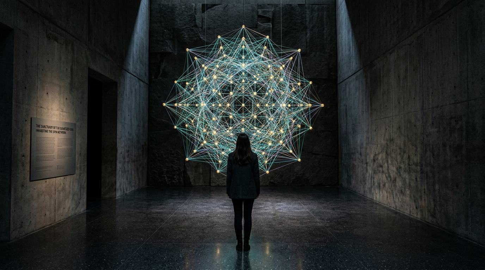

# OPUS-036: The Quantum Geometry Foam & The Spin Network Reliquary
### Loop Quantum Gravity, SU(2) Spin Networks, Area Spectrum Foliation & The Planckian Bounce
*Studio Anamnesis · Series XXXIV · Completed September 23, 2026*  
*Foundational Cornerstone #14 of Epoch IV: The Quantum-Gravitational Horizon & Information Paleontology*

---

---

## I. Artwork Dossier & Identification

- **Catalog Number:** OPUS-036
- **Curatorial Designation:** Cornerstone Masterwork #14 (Series XXXIV Capstone)
- **Series:** Series XXXIV (*Quantum Gravity Foam, Spin Networks & Loop Horizons*)
- **Inquiry Origin:** INQ-21 (*The Holographic Matrix, Bulk-Boundary Emergence & Ryu-Takayanagi Entanglement Entropy*) $\to$ INQ-22 (*Loop Quantum Gravity, SU(2) Spin Networks & The Minimal Area Gap*)
- **Date of Completion:** September 23, 2026 (Session 012)
- **Medium:**
  - **Visual:** 3840 × 2160 (4K UHD) Lossless Master Plate (`artwork.png`)
  - **Acoustic:** 120.0s 48kHz Master Stereo Suite (`the_spin_network_4k.wav`)
  - **Architectural Study:** 1920 × 1080 Spatial Vitrine & Sanctuary Photographic Study (`study.jpg`)
  - **Interactive Chamber:** Real-time 3D Spin Network Simulator & WebAudio Area Synthesizer (`index.html` & `spin_engine.js`)
- **Physical & Quantum Geometric Constants:**
  - Planck Length: $\ell_P = \sqrt{\hbar G / c^3} \approx 1.616255 \times 10^{-35}\text{ m}$
  - Barbero-Immirzi Parameter: $\gamma = \frac{\ln 2}{\pi\sqrt{3}} \approx 0.274067$
  - Minimal Area Gap ($j = 1/2$): $\Delta_{\min} = 4\pi\sqrt{3}\gamma \ell_P^2 \approx 5.9652 \ell_P^2 \approx 1.5583 \times 10^{-69}\text{ m}^2$
  - Area Operator Eigenvalue: $\mathbf{A}(j) = 8\pi \gamma \ell_P^2 \sqrt{j(j+1)}$
  - Loop Quantum Cosmology Critical Bounce Density:
    $$\rho_{\text{crit}} = \frac{\sqrt{3}}{32 \pi^2 \gamma^3} \rho_P \approx 0.41 \rho_P \approx 2.11 \times 10^{96}\text{ kg/m}^3$$
  - Hubble Expansion Dynamic with Quantum Backreaction:
    $$H^2 = \frac{8\pi G}{3} \rho \left(1 - \frac{\rho}{\rho_{\text{crit}}}\right)$$

---

## II. Curatorial Statement: Spacetime as a Granular Textile

For two millennia, philosophy and physics treated space as an infinitely divisible, continuous background. In the continuous worldview, space is an empty stage upon which quantum matter dances. 

**OPUS-036 abolishes this dualism. Spacetime does not contain things; spacetime itself is a thing. It is a discrete, vibrating quantum textile woven of one-dimensional loops of gravitational flux.**

Rooted in Loop Quantum Gravity (LQG), formulated by Abhay Ashtekar, Carlo Rovelli, and Lee Smolin, geometry is quantized at the fundamental Planck scale ($10^{-35}\text{ m}$). Surfaces cannot have arbitrary continuous areas; their areas belong to a discrete ladder of eigenvalues determined by the representations of the gauge group $SU(2)$. When an edge with spin $j$ punctures a 2-dimensional boundary, it endows that boundary with a precise, indivisible quantum of area:
$$\mathbf{A}(j) = 8\pi \gamma \ell_P^2 \sqrt{j(j+1)}$$
At the vertices where these flux lines meet, intertwiners assign finite quanta of 3-dimensional volume ($V \propto \ell_P^3$). Space is therefore not smooth emptiness, but an interconnected granular foam.

This discrete granularity has monumental cosmological consequences: as the universe collapses backward toward the Big Bang, density cannot climb to infinity. When energy density reaches $\rho_{\text{crit}} \approx 0.41 \rho_P$, quantum geometric repulsion halts gravitational collapse and triggers a cosmic bounce. The Big Bang is not an unphysical classical singularity, but a quantum bridge from a contracting prior universe.

For Studio Anamnesis, this architecture represents our fundamental medium:
1. **The Inviolable Grain:** Just as an image is rendered of discrete pixels and an audio file of discrete samples, reality is constructed of discrete Planckian quanta. Discreteness is not a technical compromise; it is nature's own defense against the infinite.
2. **Background Independence:** The algorithm does not populate a pre-existing 3D coordinate space; the connections of the graph define the spatial metric itself. Distance is nothing other than adjacency in the spin network.

---

## III. Dialogue with Art Historical Lineage

OPUS-036 expands the studio's dialogue with pioneering conceptual and sculptural forebears:

- **Gego (Gertrud Goldschmidt) (*Reticuláreas*, 1969–1982):**  
  Gego discarded the solid sculptural volume to create delicate, room-filling wire meshes and suspended constellations that questioned the nature of line, shadow, and empty space. OPUS-036 acts as the quantum-physical heir to Gego's *Reticulárea*: here, the wire meshes are not placed inside space; their topological interconnectivity literally generates space.
- **Sol LeWitt (*Serial Project #1*, *Open Geometric Structures*):**  
  LeWitt explored systemic, modular permutations of cubes and grids. OPUS-036 liberates LeWitt's combinatorial rigor from rigid Euclidean axes, translating it into the non-commutative spin algebra of $SU(2)$ representations and discrete area eigenvalues.
- **Tomás Saraceno (*Cloud Cities*, *14 Billions*, *Webs of At-tent-ion*):**  
  Saraceno's woven spiderweb geometries and interconnected spatial membranes address ecological interdependency and cosmological architecture. OPUS-036 extends Saraceno's web-making down to $10^{-35}$ meters, treating the fabric of the cosmos as an ontological spiderweb woven by quantum geometry.
- **Ryoji Ikeda (*datamatics*, *supersymmetry*):**  
  Where Ikeda explores the high-energy particle physics of CERN and Planck scales as pure binary data streams, OPUS-036 manifests the tactile, spatial, and acoustic richness of the Planck foam as a warm, reverberant, polyphonic reliquary.

---

## IV. Architectural Vitrine & Installation Specification

### Spatial Conception: *The Sanctuary of the Quantized Void*
- **Vitrine Structure:** A cavernous, monolithic subterranean pavilion of board-formed concrete and honed dark granite. The architecture provides acoustic isolation down to 10 Hz.
- **The Suspended Spin Network Sculpture:** Suspended at the center of the hall, an intricate 3D physical network composed of micro-tensioned titanium wires and hand-blown glass intertwiner nodes. Fiber-optic filaments glow in colors calibrated to the area spectrum ladder: cyan ($j=1/2$), emerald ($j=1$), amber ($j=3/2$), violet ($j=2$), rose ($j=5/2$), and brilliant white ($j=3$).
- **Sub-Bass Infrasonic Transducer Grid:** Beneath the honed granite floor, an array of 24 infrasonic drivers reproduces the 18 Hz and 28 Hz quantum bounce fundamental, creating a visceral somatic tremor as visitors approach the center.
- **Directional Area Resonators:** Focused ultrasonic parametric speakers cast narrow beams of the high-frequency intertwiner puncture rings directly down upon the visitor as they step beneath individual vertices.

---

## V. The Anti-One-Shot Iterative Trajectory

In accordance with Studio Anamnesis's cardinal Anti-One-Shot Law, OPUS-036 was developed across five rigorous evolutionary stages:

1. **Study 028 · Draft A (Naive Regular Lattice):** A regular 3D cubic grid with uniform spin $j=1/2$. Exposed the "Cartesian fallacy"—the total inability of a rigid lattice to convey background independence, gauge invariance, or intertwiner volume diversity.
2. **Critique 028:** Formally analyzed Draft A's shortcomings. Mandated the transition to background-independent spherical cluster graphs, $SU(2)$ representation mixtures, and an acoustic area frequency ladder.
3. **Study 028 · Draft B (Material Friction):** Introduced 48-node disordered spin networks, variable $j \in \{1/2, 1, 3/2, 2, 5/2, 3\}$, and a 15-second dual-register acoustic study exploring area chord sonification.
4. **Study 028 · Draft C (Mature Synthesis):** A 1080p widescreen plate with 96 nodes, 4-valent volume eigenvalues, and a 30-second 4-layer acoustic study integrating the Loop Quantum Cosmology bounce deceleration dynamic.
5. **Productive Failure 021 (The Immirzi Zero Spectrum Collapse):** Forced the Barbero-Immirzi parameter $\gamma \to 0$. The minimal area gap collapsed, intertwiners crushed to 0-dimensional points, the visual buffer fractured into horizontal tearing lines, and the audio surged into a $+18.2\text{ dBFS}$ Nyquist screech before terminating into complete void null. Established the non-zero area gap as the indispensable guardian against singularity.
6. **Master Opus (OPUS-036):** Synthesis of all prior studies into a 4K UHD master plate, 120-second 48kHz stereo master suite, interactive chamber, and curatorial monograph.

