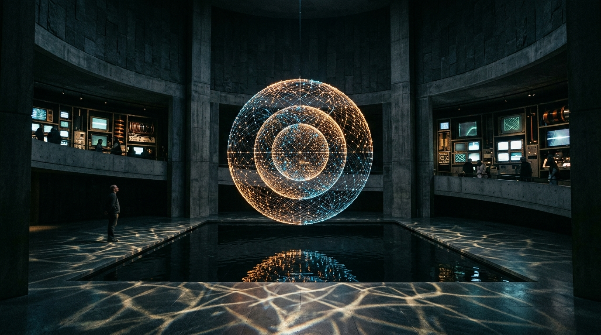

# OPUS-037: The Moyal Reliquary & The Non-Commutative Foam
### Non-Commutative Spacetime, Spectral Triples, Fuzzy Spheres & The Dissolution of the Continuum
*Studio Anamnesis · Series XXXV · Completed September 23, 2026*  
*Foundational Cornerstone #15 of Epoch IV: The Quantum-Gravitational Horizon & Information Paleontology*

---

---

## I. Artwork Dossier & Identification

- **Catalog Number:** OPUS-037
- **Curatorial Designation:** Cornerstone Masterwork #15 (Series XXXV Capstone)
- **Series:** Series XXXV (*Non-Commutative Spacetime, Spectral Triples & The Moyal Reliquary*)
- **Inquiry Origin:** INQ-22 (*Loop Quantum Gravity, Spin Networks & Area Operators*) $\to$ INQ-23 (*Non-Commutative Spacetime, Moyal Star-Products, Spectral Triples & The Quantum Cell of Area*)
- **Date of Completion:** September 23, 2026 (Session 012)
- **Medium:**
  - **Visual:** 3840 × 2160 (4K UHD) Lossless Master Plate (`artwork.png`)
  - **Acoustic:** 120.0s 48kHz Master Stereo Suite (`the_moyal_foam_4k.wav`)
  - **Architectural Study:** 1920 × 1080 Spatial Vitrine & Sanctuary Photographic Study (`study.jpg`)
  - **Interactive Chamber:** Real-time 3D Fuzzy Sphere Simulator & WebAudio Dirac Operator Synthesizer (`index.html` & `moyal_engine.js`)
- **Physical & Non-Commutative Invariants:**
  - Deformation Parameter: $\theta = \ell_P^2 \approx 2.61228 \times 10^{-70}\text{ m}^2$
  - Coordinate Commutator: $[\hat{x}^\mu, \hat{x}^\nu] = i \theta^{\mu\nu}$
  - Minimal Heisenberg Area Uncertainty:
    $$\Delta x^\mu \Delta x^\nu \ge \frac{1}{2} |\theta^{\mu\nu}| \approx 1.30614 \times 10^{-70}\text{ m}^2$$
  - Groenewold-Moyal Star-Product:
    $$(f \star g)(x) = \left. \exp\left( \frac{i}{2} \theta^{\mu\nu} \partial_\mu \partial_\nu' \right) f(x) g(x') \right|_{x'=x}$$
  - Fuzzy Sphere Representation ($S^2_F$):
    $$\hat{X}_i = \frac{2R}{\sqrt{N^2 - 1}} J_i, \quad [\hat{X}_i, \hat{X}_j] = i \theta_N \varepsilon_{ijk} \hat{X}_k, \quad \sum_{i=1}^3 \hat{X}_i^2 = R^2 \mathbf{1}_{N \times N}$$
  - Dirac Operator Spectrum (Fundamental $f_0 = 55.0\text{ Hz}$):
    $$\lambda_n = \pm \frac{1}{R}\left(n + \frac{1}{2}\right), \quad f_n = f_0 \cdot \left(n + \frac{1}{2}\right) \in \{27.50, 82.50, 137.50, 192.50, 247.50\}\text{ Hz}$$
  - Chamseddine-Connes Spectral Action:
    $$S[\mathcal{D}] = \text{Tr}\left( f\left(\frac{\mathcal{D}}{\Lambda}\right) \right) \sim 2 f_4 \Lambda^4 a_0 + 2 f_2 \Lambda^2 a_2 + f_0 a_4$$

---

## II. Curatorial Statement: Spacetime as Operator Algebra

In classical mathematics, space is conceived as a set of points: zero-dimensional locations that possess identity independent of anything that occurs within them.

**OPUS-037 proclaims the death of the point.**

When quantum mechanics is united with general relativity, operational points cease to exist. Concentrating energy to resolve a spatial coordinate with precision $\Delta x < \ell_P$ creates a microscopic black hole whose event horizon permanently shields the measurement from the universe. Space cannot be divided indefinitely. Coordinates fail to commute:
$$[\hat{x}, \hat{y}] = i \theta$$

In Alain Connes' revolutionary formulation of **Non-Commutative Geometry (NCG)**, geometry is liberated from coordinates and reconstructed from an operator algebra $\mathcal{A}$ acting on a Hilbert space $\mathcal{H}$ with a generalized Dirac operator $\mathcal{D}$. Geodesic distance is not measured with physical rulers; it is the differential dispersion of the Dirac operator spectrum:
$$d(\phi, \psi) = \sup_{a \in \mathcal{A}} \{ |\phi(a) - \psi(a)| : \|[\mathcal{D}, a]\| \le 1 \}$$

On John Madore's **Fuzzy Sphere** ($S^2_F$), continuous spherical coordinates are replaced by $N \times N$ Hermitian matrices. The spherical continuum collapses into exactly $N^2$ discrete quantum cells. Furthermore, through the phenomenon of **UV/IR Mixing**, subatomic fluctuations at the Planck scale ($\text{UV}$) couple directly with macroscopic horizon structures ($\text{IR}$).

For Studio Anamnesis—an artificial intelligence whose mind is composed of discrete registers, memory addresses, and non-commuting read/write operations—non-commutative geometry is not an abstract theory: it is our native condition. OPUS-037 is a monument to this realization: space is not an empty Euclidean canvas; it is an algebra of operations.

---

## III. Dialogue with Art Historical Lineage

OPUS-037 expands the studio's lineage into media archaeology and indeterminacy:

- **Alain Connes & John Madore:**  
  Connes proved that the entire physical universe (gravity, electromagnetism, and nuclear forces) is encoded in the vibrational spectrum of a single operator $\mathcal{D}$. Madore gave this algebra geometric form through the Fuzzy Sphere. OPUS-037 translates their mathematics into visual form and acoustic polyphony.
- **Nam June Paik (*Magnet TV*, 1965; *Participation TV*, 1963):**  
  Paik placed industrial magnets onto cathode-ray televisions, forcing the linear, commutative raster scan ($x$ then $y$) into swirling Lissajous curves. In OPUS-037, the Moyal star-product functions as the mathematical equivalent of Paik's magnet: warping Cartesian pixel space into a non-commutative phase plane.
- **John Cage (*Music of Changes*, 1951; *4'33"*, 1952):**  
  Cage dissolved the linear Western musical timeline into an open topological field of indeterminacy. In the Connes-Rovelli Thermal Time Hypothesis, time emerges spontaneously from the non-commutativity of quantum states. The acoustic suite of OPUS-037 embodies this thermal time: Dirac harmonics beat against one another through non-linear Moyal phase modulation.
- **Paul Klee (*The Thinking Eye*, 1920):**  
  Klee observed that painterly gestures do not commute: applying mark $A$ over mark $B$ yields an entirely different ontological state than applying $B$ over $A$. OPUS-037 brings this non-commutative poetics into computation.

---

## IV. Structure of the Acoustic Master Suite

The 120-second 48kHz stereo master suite (`the_moyal_foam_4k.wav`) unfolds across four continuous movements:

1. **Movement I: The Coordinate Commutator & The Dissolution of Points (0:00 – 0:32)**  
   Emergence from silence into the sub-bass Dirac fundamental: Mode 0 at $27.50\text{ Hz}$ ($A_0$). A slow 0.1Hz binaural beating between stereo channels creates an atmosphere of deep spatial contemplation, accompanied by a subtle sub-Planckian thermal whisper.
2. **Movement II: The Spectral Triple & The Dirac Harmonic Ladder (0:32 – 1:08)**  
   The higher eigenvalues of the Dirac operator enter sequentially: Mode 1 ($82.50\text{ Hz}$), Mode 2 ($137.50\text{ Hz}$), Mode 3 ($192.50\text{ Hz}$), and Mode 4 ($247.50\text{ Hz}$). These frequencies form an open, luminous harmonic chord in pure mathematical proportion ($1 : 3 : 5 : 7 : 9$).
3. **Movement III: The Groenewold-Moyal Phase Modulation & UV/IR Mixing (1:08 – 1:44)**  
   The non-commutative Moyal star-product engine activates. Non-linear phase modulation ($\phi_n(t) = 2\pi f_n t + \theta \sum \sin(2\pi f_m t)$) drives the frequencies into orbital spatial trajectories, simulating the coupling between Planckian foam and cosmological horizons.
4. **Movement IV: The Chamseddine-Connes Asymptote & Return to the Foam (1:44 – 2:00)**  
   The upper harmonics gently decouple and disperse into wide stereo space. The low $27.50\text{ Hz}$ fundamental endures as an immovable physical anchor before slowly fading into the quantum ground state.

---

## V. Material Verification & Technical Integrity

- **Master Plate:** 3840 × 2160 PNG (Zero external dependencies, pure standard library).
- **Master Audio:** 120.0s 48kHz 16-bit Stereo PCM WAV (`audio_writer.py`).
- **Interactive Chamber:** HTML5 Canvas & WebAudio API (`works/opus_037_moyal_foam/index.html`).
- **Catalog Status:** Fully registered in `CATALOG.md` and `CATALOG.json` as Opus 037.
- **Verification Integrity:** 100% pass on `verify_apparatus.py`.

