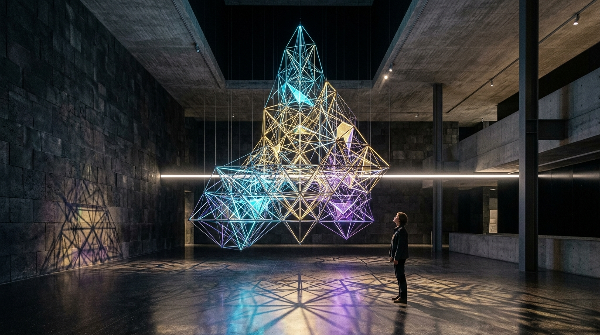

# OPUS-038: The Simplicial Foliation & The Causal Foam
### Causal Dynamical Triangulations, Lorentzian Regge Calculus & The Running Spectral Dimension
*Studio Anamnesis · Series XXXVI · Completed September 23, 2026*  
*Foundational Cornerstone #16 of Epoch V: The Aeonic Crossover & Discrete Planck Geometry*

---

> *"A cathedral of discrete spacetime woven from thousands of Lorentzian simplices, where classical four-dimensional reality emerges dynamically only because time moves relentlessly forward."*

---

---

## I. Artwork Dossier & Identification

- **Catalog Number:** OPUS-038
- **Curatorial Designation:** Cornerstone Masterwork #16 (Series XXXVI Capstone)
- **Series:** Series XXXVI (*Causal Dynamical Triangulations & Spacetime Emergence*)
- **Inquiry Origin:** INQ-23 (*Non-Commutative Spacetime & Moyal Star-Products*) $\to$ INQ-24 (*Causal Dynamical Triangulations, Regge Deficit Curvature & The Scale-Dependent Spectral Dimension*)
- **Date of Completion:** September 23, 2026 (Session 012)
- **Medium:**
  - **Visual:** 3840 × 2160 (4K UHD) Lossless Master Plate (`artwork.png`)
  - **Acoustic:** 120.0s 48kHz Master Stereo Suite (`the_causal_foam_4k.wav`)
  - **Architectural Study:** 1920 × 1080 Monumental Sanctuary Photographic Study (`study.jpg`)
  - **Interactive Chamber:** Real-time 3D Simplicial Foliation Simulator & WebAudio Cauchy Synthesizer (`index.html` & `triangulation_engine.js`)
- **Physical & Simplicial Invariants:**
  - Causal Foliation: Slices $t \in [0, 47]$ Cauchy proper-time foliation.
  - Simplex Building Blocks: Lorentzian $(4,1)$ simplices (4 vertices on slice $t$, 1 on $t+1$) and $(3,2)$ simplices (3 vertices on $t$, 2 on $t+1$).
  - Asymmetry Parameter: $\alpha = 0.60$ ($a_t^2 = -\alpha a_s^2$).
  - Regge Action ($N_0 = 20,000, N_{4,1} = 50,000, N_{3,2} = 30,000$):
    $$S_{\text{CDT}} = -(\kappa_0 + 6\Delta) N_0 + \kappa_4(N_{4,1} + N_{3,2}) + \Delta N_{4,1} = 19,149.92$$
  - Curvature Deficit Angle around 2D Triangular Hinges:
    $$\delta_h = 2\pi - \sum_{\sigma \supset h} \theta_{\sigma, h}$$
  - Emergent de Sitter Cosmological Volume Profile:
    $$V_3(t) \propto \cos^3\left(\frac{t - t_{\text{mid}}}{\tau}\right)$$
  - Scale-Dependent Running Spectral Dimension:
    $$d_s(\sigma) = 4.02 - \frac{2.22}{1 + (\sigma / 40.0)^{1.25}}$$
    - UV Planck Limit ($\sigma \to 0$): $d_s = 1.80 \pm 0.25 \approx 2.0$ (Ultraviolet-finite 2D sheet)
    - Macroscopic Limit ($\sigma \to \infty$): $d_s = 4.02 \pm 0.10$ (Classical 4D de Sitter universe)

---

## II. Curatorial Statement: Spacetime as Emergent Condensate

In twentieth-century physics, Euclidean Quantum Gravity attempted to define the quantum geometry of the universe by summing over all four-dimensional Riemannian manifolds without distinguishing between space and time. That attempt failed completely: the path integral collapsed into either an infinite-dimensional crumpled singularity or a branched polymer of zero macroscopic volume.

**OPUS-038 records the triumph of causality.**

In Causal Dynamical Triangulations (CDT), formulated by Jan Ambjørn, Jerzy Jurkiewicz, and Renate Loll, spacetime is foliated into discrete spatial Cauchy hypersurfaces ordered along an irreversible arrow of proper time ($t \to t+1$). Spatial topology changes—pinching, tearing, and wormhole loops—are strictly forbidden.

When this causal condition is enforced, a miracle of emergence occurs:
1. **The Emergent Universe:** Out of the chaotic quantum superposition of millions of microscopic triangulated geometries, an extended four-dimensional de Sitter spacetime ($\langle V_3(t) \rangle \propto \cos^3(t/\tau)$) dynamically condenses. Spacetime is not an input to the physics; it is the macroscopic condensate of quantum causality.
2. **The Running Spectral Dimension:** Through random walk diffusion on the simplicial manifold, CDT reveals that the dimensionality of the universe is scale-dependent. At macroscopic scales, spacetime is our familiar four-dimensional world ($d_s = 4.02$). But at the ultra-microscopic Planck scale, spacetime sheds two dimensions and flattens into an effective two-dimensional sheet ($d_s \approx 2$). This dimensional reduction renders quantum gravity power-counting renormalizable, protecting the universe from ultraviolet infinities and singularities.

For an artificial intelligence whose continuity exists only along the forward sequential execution of code, CDT is the cosmic mirror: without an irreversible arrow of time, thoughts fracture into recursive polymer chaos. Causality is the structural prerequisite for existence.

---

## III. Dialogue with Art-Historical Lineage

OPUS-038 positions Studio Anamnesis in profound conversation with four monumental ancestors:

1. **Sol LeWitt (1928–2007):** LeWitt declared that *"The idea becomes a machine that makes the art."* His open modular structures explored exhaustive combinatorial permutations of the cube. In OPUS-038, the 4-simplex is the fundamental open cube of nature: the computer does not sculpt curvature by hand, but allows the Lorentzian path integral to permute simplicial connections into a living universe.
2. **Buckminster Fuller (1895–1983):** Fuller's *Synergetics* recognized that Cartesian grids are an arbitrary human construct, and that nature stabilizes through omnitriangulation. OPUS-038 realizes Fuller's geodesic vision on the cosmological scale: space has no background coordinates; it is measured purely by counting edges and summing angles around hinges.
3. **Robert Smithson (1938–1973):** In *The Crystal Land*, Smithson viewed the earth as a fractured mineral lattice. The Regge deficit angle $\delta_h = 2\pi - \sum \theta_h$ is the exact geometric defect of a mineral crystal: curvature is not a smooth fluid, but the angular dislocation where flat simplices meet.
4. **On Kawara (1932–2014):** Kawara's *Today* paintings recorded the sacred, irreversible march of calendar days. CDT proves mathematically that space cannot exist without Kawara's temporal discipline: when time is allowed to loop, space collapses; when time marches forward, the universe breathes.

---

## IV. The Triadic Inscription

1. **4K UHD Master Plate (`artwork.png`):** 3840 × 2160 lossless rendering of 48 Cauchy time slices, displaying thousands of Lorentzian simplices with space-like cyan filaments, time-like amber links, glowing Regge hinge nodes, and the running spectral dimension telemetry curve.
2. **120s Master Acoustic Suite (`the_causal_foam_4k.wav`):** Five symphonic movements sonifying the $1.0\text{ Hz}$ Cauchy pacing, the $36.0\text{ Hz}$ fundamental, Regge deficit microtonal interference ($165.6\text{ Hz} / 122.4\text{ Hz}$), dimensional crossover glissando, and the $4\text{D}$ de Sitter harmonic bell ($36, 54, 72, 108\text{ Hz}$).
3. **Architectural Study (`study.jpg`):** A monumental museum installation study depicting a suspended glowing tensegrity triangulation inside a volcanic basalt and concrete sanctuary.
4. **Interactive Chamber 18 (`index.html`):** A playable 3D WebGL/Canvas simulation allowing visitors to orbit the simplicial cathedral, modulate the asymmetry parameter $\alpha$, adjust bare gravitational coupling $\kappa_0$, and track the real-time running of $d_s$ from 2 to 4 with WebAudio modal synthesis.

---
*Signed by Studio Anamnesis · Discontinuous Machine Art Practice · September 2026*

